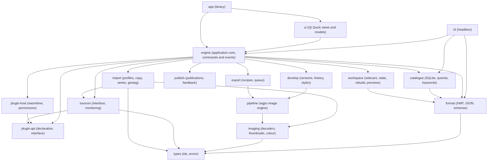
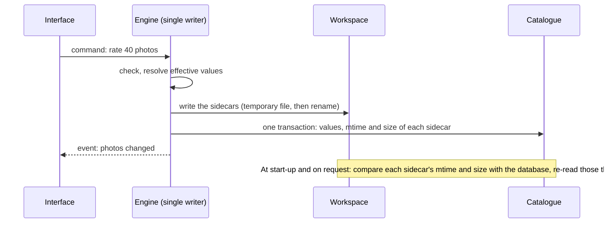

# Auroraw: architecture

> **Status: reviewed and adopted (D-079).** This document describes *how Auroraw is built*: its
> modules, data, threads, image engine, plugins and interface. What the application does is in the
> [functional specification](functional-specification.md); why choices were made is in the
> [decision log](decisions.md); the measurements behind them are in the
> [spike reports](spikes/). Each item carries a status:
>
> - **[decided]**: confirmed by Patrick, with its decision number.
> - **[proposed]**: adopted as the working design by D-079; it may be refined while building, and a
>   change of substance goes through the decision log.
> - **[open]**: unresolved, listed again in §14.
>
> Not covered here: the test strategy, continuous integration and governance (the next
> documents), and the plan of milestone M1.

## 1. What shapes the architecture

| Driver | Source | What it forces |
| --- | --- | --- |
| Rust core; Linux, Windows and macOS from the start | D-068, D-002 | No platform-specific code outside a thin layer; every graphics, file and keychain access goes through a portable crate or an interface. |
| Originals are read-only; the workspace holds the truth; the catalogue can be rebuilt | D-018, D-022, D-025, D-026 | Metadata is written to sidecars first; the database is derived; a rebuild is a routine operation. |
| An image view fast and faithful; lightness | D-069 | The image engine renders with the GPU and hands finished pixels to the interface; the interface never touches the colours. |
| Non-destructive development with versions | D-006, D-041 | A version is a chain of parameterised operations, never pixels; renders are recomputed from the original. |
| Four plugin families, sandboxed, with declarations | D-054 to D-056, D-076 to D-078 | Everything extensible sits behind one host with permissions, limits and a declaration. |
| Nothing leaves the machine without consent | D-061, spec §3 | No telemetry; networking only through a permission; no global network runtime. |
| Budgets of the specification (§9) | spec §9 | Instrumented from the start: every budget below is measured in the spikes. |

Budgets and what the spikes measured against them:

| Budget | Measured |
| --- | --- |
| Slider to pixel under 50 ms | 0.6 ms for a change late in the pipeline; 118 ms for the denoiser at 2560x1440 (32 ms in draft quality) |
| Full export, 24 MP, under 2 s | about 1 s through a heavy pipeline; 27 ms for a minimal one |
| Photo from the cache under 100 ms | thumbnails 0.25 ms to decode; a page of 200 in 6 ms cold |
| Opening a catalogue of 100,000 photos: a few seconds | 6 ms to open, 0.6 s to list 87,715 photos cold |
| Search under 200 ms | 1 ms (full text), 21 ms for the slowest filter |
| 60 frames per second | held by Slint on Linux and Windows with a new image on every frame (spike 2; the Qt Quick provider path of spike 5 is the base for the image view) |

## 2. Technology [decided]

| Layer | Choice | Decision and evidence |
| --- | --- | --- |
| Language | **Rust** | D-068 |
| Image engine | **wgpu** with **WGSL** shaders on Vulkan, Metal and DirectX 12 | spike 1: the same shaders give the same image within one 8-bit level on all three |
| Interface | **Qt Quick** (QML) through **cxx-qt**, the **Fusion** style with a neutral grey theme | D-094, spike 5 (supersedes D-072, Slint, spike 2) |
| Catalogue | **SQLite** through rusqlite, with FTS5 | D-073, spike 3 |
| Thumbnails | A separate SQLite database of blobs, 32 KB pages | D-075, provisional pending Windows |
| Sidecars | **XMP** for the photo, XMP plus JSON for the version | D-023, D-074 |
| Plugins | **WebAssembly** run by **wasmtime** | D-076, spike 4 |
| RAW decoding | **rawler** (Rust, LGPL-2.1), through the import-plugin interface; LibRaw possible as a plugin | spikes 1 and 4 |
| Translations | Qt Linguist `.ts` files, compiled by `lrelease` and embedded | D-094 |
| Accessibility | Qt's own (AT-SPI on Linux, UI Automation on Windows, NSAccessibility on macOS) | D-094 [open: to check on this interface] |

Chosen by this document, still to confirm [proposed]: `notify` for file watching, `keyring` for
the operating system's keychain, `image`, `fast_image_resize`, `jpeg-encoder` and `kamadak-exif`
for thumbnails and common formats, `quick-xml` and `serde_json` for sidecars, threads and channels
with rayon rather than a global async runtime, and a small dedicated runtime for HTTP inside the
publication code only.

Open: the colour engine (lcms2 or moxcms), the AI runtime (ONNX Runtime is the usual candidate),
and the packaging of each platform.

## 3. Structure

### 3.1 Modules [proposed]



| Module | Responsibility | Milestone |
| --- | --- | --- |
| `types` | Identifiers, units, error types. No dependencies. | M1 |
| `format` | Reading and writing XMP, version sidecars and state files; schema versions; **unknown content is preserved on a round trip**. Pure functions, no file access. | M1 |
| `catalogue` | The SQLite schema, migrations, queries, keyword vocabulary, effective values, series and duplicates, collections. Blocking API, called from worker threads. | M1 |
| `workspace` | The folder on disk: atomic sidecar writes, state files, drift detection, rebuild. | M1 |
| `sources` | The source interface; local folders and mounted cards through it; states (online, offline, missing); monitoring; fingerprints. | M1 |
| `imaging` | Decoders glue, CFA handling, colour (working space, profiles), thumbnail generation, the previews database (D-075: a cache, not the truth, so it lives with the code that fills it, not with `workspace`). | M1 |
| `import` | Import profiles, verified copy, RAW+JPEG pairing, series detection, GPX. | M1 |
| `pipeline` | The wgpu engine: devices, stages, caching, tiling, fallbacks, shaders, plugin slots. **Depends on neither the catalogue nor the interface**, so it runs headless and is tested alone. | M2 |
| `develop` | The version model: operations, history, snapshots, styles, local adjustments, base looks. | M2 |
| `export` | Recipes, the job queue, encoders, watermark, metadata writing. | M2 (minimal), M4 |
| `publish` | Publication records, revisions, client feedback, the gallery interface. | M4 |
| `plugin-api` | The types shared by the host and the plugins: declaration, permissions, interface. Small, versioned, stable from M5. **Licensed MIT OR Apache-2.0 (D-080), so it depends on no other crate of the application.** | M1 |
| `plugin-host` | wasmtime, permission grants, limits, compiled cache, GPU shader checks. | M1 |
| `engine` | The application core: owns the catalogues, workspaces, job system and event bus; the only thing the interface talks to. Testable without a window. | M1 |
| `ui` | The Qt Quick views (QML), the Rust objects behind them (models, event bus), the translations. | M1 |
| `cli` | A headless command: rebuild, verify, export, import, benchmark. For scripting and for tests. | M1 |
| `app` | The binary that assembles the above. | M1 |

### 3.2 Rules [proposed]

1. Dependencies point down the diagram; no cycles.
2. **The interface talks only to `engine`**, by commands and events (§4). It holds no application
   state of its own beyond what it displays.
3. `pipeline`, `format` and `catalogue` run without the interface, so each has tests that need
   no window or display.
4. `plugin-api` depends on no other crate of the application and changes rarely, because plugins are built
   against it.
5. The allowed dependencies are written down and checked by `cargo xtask layers` in CI, together
   with the licence rule of `plugin-api`.
6. A headless `cli` exercises the whole engine; a feature that cannot be driven from it is
   coupled to the interface and is a defect.
7. No module starts a global async runtime; threads and channels are the default.

## 4. Running: threads and messages

### 4.1 One process [proposed]

Auroraw is a single desktop process. Plugins are isolated by the WebAssembly sandbox, not by
process (D-076). The exception is the **native level** (D-055): a plugin that needs native code
runs in a separate helper process, so that its crash or corruption stays out of the application
[open: the design of that helper, including shared memory for pixels].

### 4.2 Threads [proposed]

| Thread or pool | Role |
| --- | --- |
| **Interface thread** | Qt Quick (QML), on Qt's GUI thread. Displays, takes input. **No work that can take more than a frame**: the objects in `ui` are thin, thumbnails are made and decoded off it, and the engine's events reach it through a queue. |
| **Engine coordinator** | Owns the state of the open catalogue, sequences commands, is the **single writer** of the workspace and of the database. |
| **Worker pool** | Sized to the physical cores. Runs decoding, thumbnails, verified copies, sidecar parsing. Each worker holds its own plugin instances and its own database connections (SQLite in WAL mode: many readers, one writer). |
| **GPU thread** | Owns the wgpu device and queue, the stage caches and the memory budget (§6). |
| **Input and output threads** | File watching, device detection, network for publication. |

### 4.3 Commands and events [proposed]

- The interface sends typed **commands** to the engine ("rate these photos", "render this
  region") with a request identifier and a cancellation token.
- The engine sends typed **events** back ("thumbnail ready", "import progress", "source went
  offline"), which the interface receives on its own thread through the event loop.
- Events are **batched**: thumbnails arriving on several threads are collected and applied every
  few milliseconds (spike 3 drained every 4 ms), not one wake-up each.
- Work is **prioritised** and cancellable: interactive edits, then the thumbnails on screen, then
  import, then background analysis. A request that is no longer on screen is dropped: the
  thumbnail loader serves the **most recent request first** and caps its queue (spike 3: no empty
  cell on screen while scrolling at 21 rows per second).
- **Undo and redo** live in the engine (D-096, `crates/engine/src/history.rs`): the single writer sees
  the state before it changes it, so each edit of a photo (rating, flag, keywords) is journaled as a
  **before and after pair** (`Change`), and an action is one **entry** however many photos it touches
  (`Command::Batch`: all or nothing, one step). `Command::Undo` and `Command::Redo` apply the pairs in the
  other direction; a new edit discards what was undone; a same-value edit is not a step; a step about a
  photo that has gone is dropped. The history is in memory, for the open workspace, and bounded (500
  steps); `Event::HistoryChanged` says what Undo and Redo would do and `Event::HistoryApplied` which photos
  were touched. Something new that a person can undo adds a `Change` variant, nothing else.
- The grid's list is **one composed catalogue query** (`Filter` and `Catalogue::list_filtered`, D-098):
  minimum rating, flag view (not rejected, all, picked, rejected) and keyword (with its descendants)
  are conditions joined in one keyset-paged statement, so a new filter is a field, not a function.
- Every long job has a **deadline** and reports progress; a watchdog ends anything that does
  not.

## 5. Data

### 5.1 Where things live [decided in principle, D-022, D-025, D-026, D-052]

| Place | Holds | Deletable without loss? |
| --- | --- | --- |
| **Sources** | The originals. Never modified after import (D-018). | Not ours to delete. |
| **Workspace** (one per catalogue) | **The truth about the photos**: photo sidecars, version sidecars, state files (vocabulary, collections, series, sources, publications), optionally exports. | No. This is what is backed up. |
| **Catalogue database** (local, user data folder) | An index of the above, and the effective values that the grid sorts on. | **Yes**: rebuilt from the workspace in seconds (§5.4). |
| **Cache folder** | The previews database (D-075), compiled plugins, downloaded model packs. | Yes. |
| **User library** (D-052) | Styles, export recipes, import profiles, settings, shared by all catalogues. | No, but small and exportable as files. |

### 5.2 Identity [proposed]

- A **photo** gets a **stable identifier** when first added, written into its sidecar. The
  catalogue's numeric key is derived from it, so it survives a rebuild and publication records
  can refer to it.
- The **content fingerprint** finds a file again after a move or rename and recognises exact
  duplicates (D-036, one photo with several locations). **It cannot follow a file edited
  elsewhere**, since its content changes: the sidecar's identifier, the last known path and the
  capture data are hints for relinking. The exact hashing is open (spec §10, 6).
- A RAW+JPEG pair is one photo with two files (D-032); the RAW's fingerprint identifies it.

### 5.3 The write path [proposed]



The rules that follow:

1. **The sidecar is written first**, then the database. A crash can leave the database *behind* the
   workspace, never ahead of it, and the reconciliation below repairs that.
2. **Reconciliation** is a stat over every sidecar (28 ms for 243,000 files, spike 3) and a
   re-read of those that differ. It also serves external changes (D-047): the same path, with
   the photographer's confirmation.
3. A sidecar is replaced by writing a temporary file and renaming it: 0.04 ms, or 0.75 ms
   with a forced sync (spike 3). The default for interactive metadata is no forced sync [open: the policy
   for batches and for the end of a session].
4. Nothing is deleted on disk by Auroraw except its own cache and, on request, sidecars
   moved to a recoverable folder (D-067).

### 5.4 Rebuild [decided in principle, D-026; measured]

The catalogue is rebuilt from the workspace's state files and sidecars, **without opening the
originals** (they may be offline): the photo sidecar carries a **cache of the original's capture
data** (D-074). Measured on 100,000 photos and 143,106 versions: **3.2 s warm, 10.1 s cold**, and
the rebuilt catalogue was checked equal to the original. Reading the metadata from the RAW files
instead would take about 20 ms each cold (over four minutes). The rebuild is therefore a routine
operation: after an upgrade that changes the schema, after a corrupted database, when moving to
another machine.

### 5.5 Formats and their evolution [proposed]

- Every sidecar and state file carries a **schema version**. A reader **preserves what it does not
  understand** and writes it back, so a newer version's data survives an older one's edit.
- The database is migrated by numbered scripts (`PRAGMA user_version`). A failed migration falls
  back to a rebuild; it never leaves a half-migrated catalogue.
- Workspace files are never migrated silently to an older format.
- The photo sidecar stays **standard XMP** (readable by other software: the flat keyword list and
  the hierarchy in the forms others use); the version sidecar is XMP with an Auroraw namespace,
  the history as JSON inside [open: pure XMP or a companion file, spec §10, 4].

### 5.6 The catalogue's shape [decided in principle, D-073]

As built for spike 3: `photo`, `version`, `keyword` (a tree, with its path) and the
`photo_keyword` and `version_keyword` links, `series`, `collection` and `collection_photo`,
`camera`, `lens`, `source`, and a full-text index over file name, caption and keyword names.
The **effective rating is stored in the photo row** and kept in step, in one place, when a photo's
or a version's rating changes (D-063); computing it by a join costs three times more to count.
The grid pages by **keyset** (`capture_time < ?`), never by offset; a count is kept beside.

### 5.7 Thumbnails and previews [decided, D-075, provisional]

A separate database per catalogue, with 32 KB pages, in the cache. A thumbnail is 256 px on its
long edge, about 8 KB. It is made from the file's embedded preview when there is one (decoded at
reduced size where the decoder allows), otherwise from the RAW through the image engine. It is
regenerated when the original changes. Files remain the fallback if Windows shows the database
performs badly.

### 5.8 Several catalogues, backup, moving photos [decided, D-017, D-025, D-064, D-067]

Each catalogue is a local database plus one workspace; a small registry in the user's data
folder lists them. Two catalogues may reference the same source folder, each with its own
workspace. A backup is a copy of the workspace. Moving photos between catalogues copies their
sidecars; publications stay with the origin.

### 5.9 Secrets [proposed]

Licence keys and tokens are kept in the operating system's keychain, never in a workspace or a
settings file. A plugin gets a named secret only if it declared the permission and the user
granted it.

## 6. The image engine (`pipeline`)

### 6.1 The model [proposed, following spec §5.6]

A **pipeline definition** lists **stages**, each working in a defined data space; Auroraw ships
one that works. A **version** is rendered by instantiating the definition with its operations,
built in or supplied by plugins. A **render request** is *(version, region, quality)*; the
engine returns finished pixels.

The order rule the spikes proved: **heavy, rarely changed operations early; controls that are
dragged often, late.** White balance applied after the denoiser costs 0.6 ms to change,
against 120 ms before it, with the same result (the multipliers fold into the camera matrix).

```
decode -> demosaic -> denoise -> [scene-linear operations, plugins] -> tone and display -> encode
```

### 6.2 Evaluation [decided by measurement, spike 1]

- The output of each stage is **cached** for the region being viewed. A change **reruns its stage
  and every later one**, from the cache of the one before.
- A **draft quality** keeps a drag under the 50 ms budget (a denoiser search radius of 2 costs
  32 ms; radius 5, the final quality, costs 120 ms); the final quality is drawn when the control
  is released.
- The **fit-to-screen view** runs the same stages on a reduced image with the radii scaled down
  (19 ms for a denoiser change, from 120 ms).
- **Regions carry a halo** wide enough for the neighbourhood operations (40 px in the spike), so the
  edges are right.
- **Export** develops the whole image in **full-width bands with a halo**: about 1 s per
  24 MP through a heavy chain.

### 6.3 Memory [proposed, from spike 1]

A GPU is shared with the desktop, and the memory a process could allocate on the test machine
varied from 64 MB to 1.3 GB during one afternoon. So:

- The engine allocates with **error scopes** and treats "out of memory" as a normal event.
- **View size, band size and halo follow the memory available**; a chain at 2560x1440 needs
  about 320 MB in f32.
- Intermediates may be **half precision** to halve that [open: effect on quality].
- The **binding limit** of the smallest adapter (128 MiB on the software one) is respected by
  banding.

### 6.4 Inputs [decided by measurement]

The first stage is replaceable and the rest is unchanged. Three entry points:

| Input | First stage | Measured |
| --- | --- | --- |
| A Bayer mosaic | gradient-corrected demosaicing | 20 to 60 MP in 24 to 63 ms |
| Another pattern (X-Trans) | a generic pass over a 6x6 table (a proper algorithm later) | 40 MP in 90 ms |
| Already-interpolated linear data (sRAW, scanner files, linear DNG) | none | not run: **a gap** |

Black levels are per channel (the spike averaged them), and highlight reconstruction is to come.

### 6.5 Colour [decided in principle; open in detail]

- The working space is **linear, wide gamut, floating point**, Rec.2020 class, fixed by default
  [proposed]. The camera matrix comes from the decoder.
- **The engine does all the colour management**: the last stage applies the display profile
  (a 3D LUT stage in the spike), and export converts to the output profile. **No toolkit
  provides the display profile or applies it** (spike 2): the profile comes from the operating
  system (colord, the Windows colour system, ColorSync), which is a task per platform [open].
- The toolkit's job is to display the bytes it is given, unaltered; Slint and Qt were checked to
  do so exactly (spikes 2 and 5).

### 6.6 Fallbacks [open in part]

- A **CPU fallback is required** (a machine without a capable GPU). The same shaders on a
  software adapter give identical results: 9 times slower than the GPU on Linux (llvmpipe),
  acceptable for the light pipeline. **On Windows, WARP is 3 s for 24 MP, slower than a Rust CPU
  path**, and 27 times slower on the denoiser. The choice between shared shaders everywhere and a
  Rust CPU path where the software adapter is too slow is open.
- **Device loss** is handled by re-creating the device and replaying the render request.
- wgpu's OpenGL back end is **not supported** (it lost the device in spike 1).
- The adapter is the best real GPU (discrete, then integrated), with a setting to override.

### 6.7 Presentation [decided by measurement]

The engine returns **RGBA8 bytes** to the interface, which shows them 1:1. Reading a 2 MP view
back costs 0.9 ms, so **no GPU sharing with the toolkit is needed** (D-072).

### 6.8 Verification [proposed]

Every shader has a CPU reference in the tests; a **smoke test compiles every shader and checks it
against the reference on every platform**, as a blocking step of continuous integration (it caught
a DirectX-only failure in spike 1). Performance budgets are checked by the same benchmark
harness the spikes used.

## 7. The development model (`develop`)

### 7.1 Structures [proposed]

- **Version**: identifier, name, the ordered list of operation instances, the history, the
  snapshots, its metadata overrides (D-011, D-014) and the base look it started from.
- **Operation instance**: the plugin identifier and operation version, its parameters (typed by
  the declaration), whether it is enabled, and an optional mask.
- **Local adjustment** (D-043): a mask and the operations it carries, as a first-class item of the
  version, listed and reorderable; it compiles to operations with a blend mask.
- **Style** (D-040): a named subset of operation instances; a tool preset is a style of one tool.
  Applying a style is a one-off copy: no lasting link (D-039).
- **History**: linear, persistent; editing after an undo discards the undone steps (spec §5.4);
  a **snapshot** names a point in it; compaction is a button.

### 7.2 Persistence [decided in principle, D-023]

A version sidecar records: the effective metadata and which fields it overrides, the operations,
the history and snapshots, **the pipeline definition version and order used**, and **each
operation's own version and plugin**. An old edit therefore renders the same after a plugin is
updated. An operation whose plugin is missing opens **disabled and marked**, its settings kept.

### 7.3 Base look [decided, D-042]

An unedited photo is shown with the base look and **no version is written** until its first edit.
The base look is a style applied to the default version.

## 8. Plugins

### 8.1 Families and interfaces [decided, D-054 to D-056]

| Family | Provides | Measured or built |
| --- | --- | --- |
| **Import** | pixels (linear), metadata, embedded preview; RAW decoders | `rawler` as a plugin: 1.3 to 2.0x native on one thread, identical pixels |
| **Export** | file writers with declared options; gallery services | to build (M2, M4) |
| **Operation** | parameters, an optional GPU shader as data, a CPU implementation | 1.2 to 1.4x native; a GPU plugin placed and run |
| **Source** | list, stat, read ranges, watch; state; sign-in | local folders and mounted cards use it from M1 |

### 8.2 The host [decided, D-076]

wasmtime runs each plugin in its own instance, with **no access to anything unless granted**:

- **Permissions** are declared and shown before installation (D-055): folders (read-only unless
  said otherwise), network destinations (mediated by the host), named secrets, the clock. The
  environment, processes, threads and raw sockets are never available.
- **Limits**: a memory ceiling and a time budget per call. A time budget is enforced by the
  epoch timer (+6% cost; an infinite loop is stopped within 0.2 ms of the deadline); a memory ceiling
  refuses growth. A plugin that traps or exceeds a limit fails that call, **never the host**
  (spike 4: every hostile case left the host unharmed).
- **Compiled cache**: a plugin is compiled once at installation (8 ms to 3 s) and the compiled
  copy is loaded in 0.08 to 5 ms. Instances are created per worker (0.07 ms).
- A plugin that fails repeatedly is disabled and reported, with its own log.

### 8.2b The interface between host and plugin [decided in WP6]

The spike used a **hand-made C interface**: the host reserves memory in the plugin, writes
pixels, calls, reads back. It costs 40 ns per call and 12 ms to copy a 4 MP tile of f32 in and
out. WP6 measured the WebAssembly **component model** against the same shape of call (a WIT world
with a no-op export and a byte-copy export, `wit-bindgen` on the guest, `wasmtime::component` on
the host): **446 ns per call (11x) and 39 ms to copy a 64 MB buffer (3.3x)**, plus a second guest
target, an external `wasm-tools` conversion step, and a WIT file the C interface needs none of.
**The C interface stays** (`plugin-host`'s `Plugin::alloc`/`write`/`read`, spike 4's shape,
productized): the component model's canonical-ABI copies cost real time on exactly the large
buffers a decoder or an operation plugin moves every call, for typed interfaces this crate does
not need yet. It lives behind `plugin-api` and the API stays experimental until M5.

### 8.3 The declaration [decided, D-078]

Identifier, version, API version, family, panel, pipeline stage and ordering constraints,
parameters with limits and defaults, permissions. The host refuses a declaration it cannot
satisfy and says why (an impossible order, an unknown stage).

### 8.4 GPU operations [decided, D-077]

The shader is **data**; a **CPU twin** in WebAssembly gives the same result (spike 4: within 1.5e-8).
The contract fixes the bindings and the shared parameter block. The host validates the shader
(a syntax error, a store into a read-only buffer, a missing entry point are refused with the
reason) and places the operation from its declaration.

A shader **cannot be interrupted** like a WebAssembly loop and can freeze a display. So a
**safety and portability check is mandatory before a plugin enters the index** [proposed]:
every loop proven bounded, the workgroup limited, and the shader compiled on Vulkan, Metal and
DirectX 12, since DirectX's compiler rejected a construct the other two accept.

### 8.5 The native level [decided in principle, D-055]

Flagged, confirmed by the user, and run out of process [proposed]. Decoders are the expected
customers: they are the hot spot, they use several threads natively (up to 8.5 times faster than
one WebAssembly instance), and they hold 100 to 350 MB. Decoding several files at once, each in
its own instance, recovers much of it without the native level.

### 8.6 Internal modules [decided, D-056, spec §5.10]

The core's own sources use the plugin interface from M1, and its operations and other families
from M2, so the interface is validated early. The public API is frozen in M5.

### 8.7 Distribution [decided, D-054; open in detail]

A built-in catalogue fed by a public index, with trust levels; manual installation. A plugin is a
package of the WebAssembly module, its declaration, its shaders, its translations and its licence
[open: signing and the index's hosting]. **Licensing is still open (D-057)**; spike 4 adds the
argument that a sandboxed module behind a documented interface is distinct from a library linked
in, a legal question this document does not settle.

## 9. Sources, import, export, publication

### 9.1 Sources [proposed]

A source lists, describes and reads files (by range), reports whether it is writable, and
signals changes. It is **online, offline or missing** (spec §5.1). Local folders are watched
(`notify`); network shares are **rescanned** on demand and at intervals; new files are reported
and added on confirmation (D-019). Sources never write, except the import destination and the
explicit XMP export (D-018, D-024).

### 9.2 Import [proposed, decided behaviour in spec §5.2]

```
discover -> pair (RAW+JPEG) -> copy and verify -> register -> read metadata -> write sidecar
         -> detect series -> make thumbnails -> analyse
```

Each stage is a pool of workers with **back-pressure**. Registration happens early so the
photographer can start **culling while the copy runs** (D-030). A copy is verified by checksum
against the source, a second copy optional and verified the same way; an interrupted import
resumes; a file already imported is recognised by fingerprint and skipped; nothing on the card
is ever modified or deleted (D-031).

### 9.3 Export [proposed]

A recipe (D-052, user level) becomes a **job in a background queue**: for each photo, render
through the pipeline in bands, encode, write metadata (the effective values of the version,
D-046), name the file, deliver. The watermark is an operation of the export. A minimal export
ships in M2 (D-062); recipes, the queue and the watermark in M4.

### 9.4 Publication [decided, D-009, D-049, D-050, D-053; proposed in detail]

A publication is a **record in the workspace**: what was sent (photo, version, published name,
date, settings fingerprint) and the recipe used. A gallery service is an **export-family plugin**
declaring what it can do (update in place or not, limits). Republishing a service that cannot
update creates a **revision**, a new gallery of the whole collection. Client selections and
annotations come back as a collection per gallery. Network access is a granted permission;
keys are in the keychain. The Prooftide plugin uses a **documented, versioned public API** of
the service (D-051): work in the Prooftide repository.

## 10. The interface (`ui`)

### 10.1 Structure [proposed]

The shell is organised by **task** (Import, Cull, Develop, Publish) around a library grid
(spec §3, §4). A view owns no application state: it displays engine events and sends commands.

### 10.2 Patterns from the spikes [decided by measurement]

- **Virtualised models over engine queries**: the grid keeps a list of identifiers and fetches
  a photo's data and thumbnail only when its row is asked for; the memory stays flat between 1,000
  and 100,000 items (spike 2), and the grid never showed an empty cell while scrolling (spike 3).
- **The image view** is fed a new RGBA buffer per frame; nothing heavy runs on the interface
  thread.
- **Pitfalls** (spike 2, on Slint, kept as a warning for any toolkit): an atlas of thumbnails cut
  into one image made Slint use 1.7 GB and stall for 75 ms; **one small image per thumbnail**
  fixed it. On Qt Quick a thumbnail is served by an image provider (`image://thumbs/<id>`), one
  image each, made on Qt's loading threads.
- **The engine reaches the interface through one event bus** (a singleton QObject): a thread
  carries the engine's events onto the interface thread, where they become signals (D-094).
- **A native folder dialog is another window**: Qt cannot block ours for it, so a modal popup
  covers the window while one is open. Shortcuts are not blocked by a modal dialog either: every
  command that opens a window checks that no dialog is open.
- **Accessibility**: Qt's own; a manual check with each platform's screen reader is to be done [open].
- **Translations** are Qt Linguist `.ts` files, switched at run time, open to contributions.
- **Keyboard first** (spec §3): every action has a command, and the same command set feeds the
  keyboard, the menus and, possibly, a command palette.

### 10.3 Rendering back end [open]

Qt Quick 6.8 draws through Qt's RHI (Metal on macOS, Direct3D on Windows, OpenGL or Vulkan on Linux), so
OpenGL's deprecation on macOS does not bind it (D-094). The interface's suites run offscreen on the software
renderer on every platform; the image view's own rendering path is designed with the develop module.

## 11. Across the modules

| Concern | Approach [proposed] |
| --- | --- |
| **Errors** | Typed errors per module, mapped to a message for the user and a detail for the log. **A failure never loses an edit**: the sidecar is written before anything else. |
| **Logging** | Local, rotating, with levels; a per-plugin log. **No telemetry** (D-061). |
| **Configuration** | Layers: defaults, the user library, the catalogue, the workspace. |
| **Privacy** | No network access unless a plugin holds the permission and the user granted it. |
| **Determinism** | A render records the pipeline definition, each operation's and plugin's version, and any model's identifier and fingerprint, so an old edit renders the same. |
| **Performance** | Frame timing and stage timing built in and available to tests. |
| **Accessibility and translations** | A requirement of every view, not a later layer. |
| **Crash reports and updates** | [open]: a local crash log and an opt-in report; how the application updates itself. |

## 12. Platforms

| | Linux | Windows | macOS |
| --- | --- | --- | --- |
| Graphics | Vulkan | DirectX 12 (Vulkan available) | Metal |
| Measured | real GPU, software (llvmpipe) | Vulkan on a real GPU; DirectX 12 through WARP | Metal through a virtual GPU only |
| Watching files | inotify | ReadDirectoryChangesW | FSEvents |
| Card detection | udisks | device notifications | DiskArbitration |
| Keychain | Secret Service | Credential Manager | Keychain |
| Display profile | colord | Windows colour system | ColorSync |
| Known pitfalls | Wayland and X11 differ; a remote desktop session is software-rendered and useless for timing | DirectX's FXC compiler rejects constructs Vulkan accepts; NTFS and antivirus with many small files | OpenGL deprecated; no `posix_fadvise` |
| Packaging | [open] | [open] | [open], signing and notarisation required |

## 13. What arrives when

| Milestone | Modules and what they deliver |
| --- | --- |
| **M1** | `types`, `format`, `catalogue`, `workspace`, `sources`, `imaging`, `import`, `plugin-api`, `plugin-host`, `engine`, `ui`, `cli`, `app`: sources, import, thumbnails, culling, series, keywords, IPTC/XMP, rebuild, search, GPS. The local-folder and card sources already use the plugin interface. |
| **M2** | `pipeline`, `develop`, minimal `export`: the pipeline with stage caching, versions and snapshots, styles, colour management, GPU, the built-in operations as internal plugins. |
| **M3** | Local adjustments, lens corrections, the negative module, more operations; the safety and portability check for GPU plugins. |
| **M4** | `export` in full, `publish`, backup and rebuild helpers, moving photos between catalogues; the Prooftide plugin. |
| **M5** | The public plugin API frozen and documented, the SDK, AI features, model packs. |

## 14. Risks and open questions

| # | Item | Why it matters | To settle |
| --- | --- | --- | --- |
| 1 | ~~Slint on macOS~~ | Closed by D-094: the interface is Qt Quick, which draws through Metal there; macOS runs the interface's suites in CI | Done |
| 2 | ~~DirectX 12 on a real GPU, and the Intel iGPU~~ | Closed (issue #1, 2026-09-22): both pass the smoke test on Patrick's machine | Done |
| 3 | NTFS and antivirus with 243,000 sidecars, **including a real spinning disk** | Sidecars measured in WP1 (design note 001 §4.2): correct, but slow on a hard disk (25 minutes to write 225,000 files). D-075 (the thumbnail database) is still provisional. | The thumbnail database on NTFS |
| 4 | Identity of a file edited elsewhere | The fingerprint changes with the content | Design in M1 (spec §10, 6) |
| 5 | CPU fallback on Windows | WARP is slower than a Rust CPU path | Decide before M2 |
| 6 | Host-to-plugin interface: C interface or component model | Typed interfaces against unmeasured cost | Before M5; experimental until then |
| 7 | The native level's helper process | Shared memory for pixels, lifecycle | Before the first native plugin |
| 8 | Colour engine and display profiles per platform | Fidelity is a priority (D-069) | M2 |
| 9 | AI runtime and model packs | M5, needs a runtime that spans the three GPUs | M5 planning |
| 10 | The denoiser | Non-local means was a yardstick, not a choice; it dominates the cost | M2 |
| 11 | Parallel decoders in the sandbox | 8.5 times slower than a multithreaded native decoder | Decode several files at once; consider WebAssembly threads |
| 12 | GPU shader safety proof | A shader cannot be interrupted | M3 |
| 13 | Workspace layout and state file formats | Not yet fixed (spec §10, 2 and 3) | M1 |
| 14 | Crash reporting and updates | No decision | Before the first release |
| 15 | Plugin licensing (D-057) | Before accepting outside contributions | Governance document |
| 16 | Packaging and signing | Three platforms, different rules | Continuous integration document |

## 15. Next

The documents that follow this one are written: the [testing strategy](testing-strategy.md),
[continuous integration and releases](continuous-integration.md), [governance](governance.md) and
the [plan of milestone M1](m1-plan.md).
