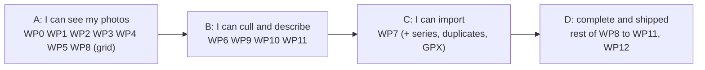

# Milestone M1 plan: a complete culling and organising tool

> **Status: adopted (D-084).** The plan of the first milestone of the product, from the
> first line of product code to a usable pre-release. It follows the milestone table of the
> [specification](functional-specification.md) (§8), the [architecture](architecture.md), the
> [testing strategy](testing-strategy.md) and the [release plan](continuous-integration.md).
> Items are tagged **[decided]**, **[proposed]** or **[open]**. There are no calendar dates: the
> plan gives an order, sizes and exit criteria. The pace depends on review and testing time on
> three platforms, which is Patrick's, so the sizes are relative (S, M, L, XL) and are revised at
> the end of each increment.

## 1. Goal [decided, spec §8]

**M1 gives the photographer a complete culling and organising tool**: catalogues and workspaces,
sources, import from a card or a folder with profiles, previews, culling, series and duplicates,
keywords, ratings, IPTC/XMP, XMP export to source folders, search and filters, and GPS.

There is **no development pipeline yet** (M2). Photos are shown from the **previews embedded in the
files** (RAW and JPEG), which is also what most culling uses. Consequences to state plainly:

- Nothing in M1 needs the wgpu engine: the `pipeline`, `develop` and `export` modules start in
  M2, and their absence in M1 is what keeps M1 achievable.
- An import profile's "apply a style" setting waits for M2 (it needs versions); the profile stores
  it but does not act on it [proposed].
- The focus peaking, clipping warnings, blur score and histogram of the cull mode are computed
  **from the preview**, on the CPU. They say what the preview says, not what the RAW holds. That
  is enough to choose between frames, and is written in the interface's help [proposed].

## 2. Exit criteria [proposed]

M1 is done when **all of these hold on Linux, Windows and macOS**, checked by the automated suite
where possible and by the release checklist (testing strategy §11) otherwise:

1. **The scenarios of §7 pass**, on a catalogue of 100,000 photos and on a small real one.
2. **The budgets** of the specification (§9) that concern M1 are met on Patrick's reference
   machines: grid scrolling, a photo from the preview cache under 100 ms, opening a catalogue
   of 100,000 photos in seconds, search under 200 ms.
3. **The catalogue can be deleted and rebuilt** from the workspace in seconds, with the same result
   (the permanent test of the testing strategy).
4. **A crash at any moment loses no edit** (crash-consistency tests, on all three platforms).
5. **Originals and cards are never modified** (checked by checksum in the import tests, D-018, D-031).
6. **Accessibility and translation**: every control has an accessible name and a keyboard path;
   English and French are complete; the pseudo-locale check passes.
7. **Installable pre-release** `0.1.0` for each platform (unsigned if signing is not ready,
   CI §6.3), with the user-visible documentation of what M1 does.
8. **Interoperability**: sidecars and exported XMP read correctly in ExifTool, and a keyword
   hierarchy and rating written by Auroraw show up in at least one other photo application
   (darktable or digiKam are free) [proposed].

## 3. What is in and out [proposed]

| In M1 | Out (later milestone, or open) |
| --- | --- |
| Catalogues (several, equal), workspaces, rebuild, reconcile | Development, versions, styles, export recipes (M2, M4). Versions exist in the model and the sidecar format (empty), so the format is not changed in M2. |
| Sources: local folders, removable cards, network shares; online/offline/missing; monitoring; add in place | Cameras and phones connected directly, cloud sources (source plugins, M5 or on demand) |
| Import with profiles, verified copy, backup copy, resume, RAW+JPEG pairs, metadata template, GPX | Applying a style at import (M2) |
| Previews and thumbnails from embedded previews; JPEG, TIFF, PNG, DNG and the common RAW formats through the decoder | Full-resolution decoding of RAW pixels (M2); HEIF, AVIF and exotic formats (on demand, as import plugins) |
| Culling: ratings, flags, labels, cull mode, comparison, undo, quality aids | AI aids (M5) |
| Series (automatic), similar-photo suggestions, exact duplicates and their report | |
| Keywords (hierarchy, synonyms), collections, smart collections, IPTC/XMP fields, batch edit | Importing a Lightroom or digiKam vocabulary (stretch, §5 WP10) |
| Search, filters, sorting | |
| GPS: reading, GPX matching with clock offset, offline place names, filter by place | **A map view**, postponed by D-084: it needs map tiles, which means a network request |
| XMP export to source folders (opt-in), external XMP change detection | Automatic XMP mirroring (not in v1, D-066) |
| Plugin API v0, host, and the RAW decoder as a real WebAssembly plugin | The public plugin API (M5); operation plugins (M2) |

## 4. How the work is organised [proposed]

**Increments, not one big bang.** M1 is built as four increments, each a pre-release someone can
use for something. The first increment is a **walking skeleton**: the whole vertical, thin, on
three platforms, so that platform, packaging and performance problems appear in the first weeks
and not in the last.

**A short design note before each work package that fixes a format or an interface**, in
`docs/design/`, followed by a decision entry for anything that changes what the application does,
a file format or an interface (governance §1). Notes are short: the question, the options, the
measurements if any, the proposal.

**Vertical slices.** A package is finished when it works end to end from the interface to the
disk, with its tests, its strings translated in English and French, its accessible names and its
keyboard path (testing strategy §9). No "wire up the interface later".

**Flow of a change** (CI §2): a branch from `dev` per package or slice, the per-change checks on three
platforms, a review. Changes to formats, the write path, the plugin API and the sandbox get the
owner's review; the others may be merged by the author when the checks are green and the change
is small (governance §3).

**Format discipline from the first day.** The first version of each file format is written with its
schema version, its fixture and its "unknown content is preserved" test **in the same change**
(testing strategy §3), because a format released without them is a migration later.

## 5. Work packages [proposed]

Sizes are relative to each other: S about a few focused days, M about a week, L a couple of weeks,
XL more. "Needs" lists the packages that must exist first.

### WP0 Foundation (S to M)

The spikes are archived (tag `spikes-final`, then `spikes/` removed from `dev`, CI §8) and the
repository takes the product layout: root workspace, `crates/` with empty crates and their
licences, `xtask/`, `rust-toolchain.toml`, `deny.toml`, the `ci.yml` of CI §3.1 (lint, build and
test on three platforms, dependencies), the SPDX header check, the test harness (`testkit`:
temporary folders and seeded random generators; the deterministic dataset generator of spike 3
moves with the catalogue schema in WP2, since it is written against it), and the launch test. The spike
harnesses that the testing strategy keeps are **moved, not rewritten**.

Done when: an empty application builds and starts on three platforms from CI, and a trivial
test of each kind runs.

**Status: done** (CI run 35551629942, all jobs green on Linux, Windows and macOS). Differences from
the plan: the dataset generator moves in WP2; `cargo audit` is replaced by `cargo deny`, which reads
the same advisories; a `cargo xtask layers` check enforces the dependency rules of the architecture,
and found that `plugin-api` (MIT OR Apache-2.0) must not depend on `types` (GPL), so it depends on
nothing. Fuzz targets and crash-consistency tests start with the formats in WP1.

### WP1 Formats and workspace (L). Needs WP0

`types` and `format`, then `workspace`.

- **Design notes** for the open questions listed in §6 (layout, file names, state files, sidecar
  content, fingerprint).
- **Photo sidecar**: standard XMP with the stable identifier, the fingerprint and last known
  paths, the cache of the original's capture data (D-074), rating, flags, labels, keywords,
  IPTC fields, and the Auroraw namespace for what XMP has no field for. Unknown content
  preserved.
- **Version sidecar**: the format of D-023 with the history empty for now.
- **State files**: keyword vocabulary, collections, smart collections, series, sources.
- **Atomic writes** (temporary file, then rename), drift detection by size and modification time.
- Fixtures for version 1 of every format; fuzz targets for the readers.

Done when: round trips and unknown-content tests pass; ExifTool reads the photo sidecars; a
workspace of 100,000 photos is written and re-read in the time spike 3 measured, **including on
NTFS** (this replaces the pending Windows run of spike 3, and settles D-075 for the workspace).

**Status: done except one measurement on Patrick's own Windows machine** (CI run of 2026-09-21).
Built: `types` (identifiers, fingerprint and hash, timestamps), `format` (the fingerprint of note 004 with
known-answer tests; the state files of note 002; an XMP reader and canonical writer; the photo and version
sidecars of note 003 with the derived copy and its digest), `workspace` (creation, marker, writer's lock,
atomic writes with the Windows retry, typed reading and writing, the scan, recoverable removal), fixtures,
generated round trips, Lightroom and darktable style files, an ExifTool interoperability test on the three
platforms, fuzz targets run nightly, and the large-workspace measurement (design note 001 §4.2). The fuzzer
found four real bugs in its first runs (namespace addresses with entities, names that cannot be written,
control characters, and floats that did not round trip exactly), all fixed with a regression test and a seed in
the corpus; `cargo deny` found two advisories in the XML library the same day, fixed by upgrading. Reading
225,000 sidecars takes 1.9 s on the developer machine and 10 to 45 s on the slowest CI runners; writing them
takes 500 to 700 s on the Windows CI runner (an SSD). **Done: the same measurement on Patrick's Windows
machine** (issue #1, 2026-09-22), on a real spinning system disk: 1,513 s (25 minutes) to write, 54 s to read
(design note 001 §4.2). Real Windows GPU results also came in the same issue: DirectX 12 on the GTX 1650 SUPER
and the Intel UHD 630 both pass the smoke test of spike 1, closing that risk (architecture §14, item 2).
WP1 is now fully done. **What the HDD number changes: batch writing needs a background job with progress on
any disk, and on a spinning one a first import or a rebuild is tens of minutes, not seconds; the interface must
not promise "a few seconds" unconditionally** (design note 001 §4.2, and risk item 2 below).

### WP2 Catalogue (L). Needs WP1

`catalogue`: the schema of spike 3 promoted to product (photos, versions, keywords with paths,
series, collections, sources, cameras, lenses, full-text index, the stored effective rating),
`user_version` migrations, the query API with **keyset paging** and counts, batch changes in one
transaction, **rebuild and reconcile** (architecture §5.3, §5.4), the registry of several
catalogues.

Done when: the queries of spike 3 give the same times through the product API; the permanent
rebuild test and the crash-consistency tests pass on three platforms; the query results agree
with a slow reference implementation on generated data.

**Status: done, pending the nightly run on Windows and macOS.** Built: `catalogue` with the schema
of spike 3 (text identifiers as primary keys instead of spike 3's integers, since the catalogue is
an index over the workspace's own identifiers, note 001 §5.2), `user_version` migrations (one
version so far, a `NewerSchema` refusal for a future one), keyset queries (`list_recent`,
`list_by_min_rating`, `list_by_camera`, `list_by_keyword`, `search` over FTS5, counts), atomic
rebuild to a temporary file with a Windows-safe rename (note 001 §5.4), reconcile against stored
sidecar stats, and the local registry of catalogues (note 001 §5.7). The dataset generator of
spike 3 moved here, reproducible from a seed (including every identifier, needed to replay a
failing test). `cargo xtask layers` was relaxed to leave dev-dependencies unrestricted, so this
crate's tests can build a real `Workspace` (a normal dependency would have broken the crate
layering of architecture §3.2) and exercise the whole write-scan-rebuild path end to end.

That end-to-end test caught a real bug on its first run: a vocabulary read back from its state
file is sorted by identifier (note 002), not parent-before-child, and the naive insert order
violated the `keyword.parent_id` foreign key. Fixed by deferring foreign-key checks to the
transaction's commit (`PRAGMA defer_foreign_keys`) rather than topologically sorting every entity
type — the general fix, since any table's insertion order can end up this way. A regression test
holds the case (the in-memory tests that fed data straight from the generator never had, since the
generator itself produces parent-before-child order).

A 100,000-photo run, on the developer machine and (the same night) on all three CI runners:

| | Developer (Linux, NVMe) | CI Linux | CI Windows | CI macOS |
| --- | --- | --- | --- | --- |
| Generate | 13.4 s | 8.7 s | 6.5 s | 11.4 s |
| Rebuild | 17.3 s | 11.1 s | 20.6 s | 14.6 s |
| A page of 200, most recent | 0.3 ms | 0.3 ms | 0.2 ms | 0.2 ms |
| "Rating 4 or more", a page | 42 ms | 41 ms | 49 ms | 52 ms |
| Full-text search | 24 ms | 23 ms | 27 ms | 24 ms |
| One photo by identifier | 0.02 ms | 0.02 ms | 0.01 ms | 0.01 ms |

Every query is comfortably inside the 200 ms budget (spec §9), consistently across platforms.
The two slower ones (rating and search) are still higher than spike 3's own figures for similarly
named queries. `EXPLAIN QUERY PLAN` shows why: both use the right index to filter, then sort the
results in a temporary b-tree, which costs more here because this dataset's uniform 0–5 ratings
and repeated placeholder title make both conditions match a much larger, less realistic share of
the photos than spike 3's dataset did. Not a defect, and not chased further in WP2; a more
realistic generator is a cheap improvement for whichever milestone next needs tighter numbers.
The measurement now runs nightly on all three platforms alongside the workspace one.

### WP3 Engine, job system and CLI (M). Needs WP1; grows with WP2

`engine`: commands and events, the single writer, the worker pool sized to physical cores,
priorities and cancellation (the thumbnail queue serves the latest request first), event
batching, deadlines and progress. `cli`: create a catalogue, add a folder, list, rebuild, verify.

Done when: the engine scenarios of the testing strategy §3 can be scripted through the CLI with
no window, and a stress test with commands from several threads ends in the state a sequential
replay gives.

**Status: done for the slice of `engine` that WP1 and WP2 already support.** Built: `engine`, a
single coordinator thread (architecture §4.2) that owns the workspace and the catalogue's only
writable connection, applying `Command`s from an `mpsc` channel one at a time and echoing each as
`Event::Applied` in the order it actually processed them; `Engine::submit` (fire and forget) and
`Engine::submit_and_wait` (blocks for the outcome), both safe to call from several threads at
once; `EventReceiver` with a batch `drain` (§4.3). The commands built are the ones WP1's workspace
and WP2's catalogue can already serve without sources or develop: `Rebuild`, `Reconcile`,
`SetRating`, `SetFlag`, `AddKeyword`, `RemoveKeyword`, `CreateKeyword` and `RenameKeyword`.
`catalogue` gained the incremental write API (`apply_photo_metadata`, `apply_keyword`) that WP2
had left for whichever milestone first needed a single-row update instead of a full rebuild; that
milestone turned out to be this one. `cli` wires `create`, `list`, `rebuild`, `verify`, `rate`,
`flag` and `keyword create/rename/add/remove` to the engine.

A keyword rename is the one case WP3 already needs a background job for: it updates the
vocabulary and every affected catalogue row immediately, then refreshes the stale name snapshot
(note 003 §6) in every affected sidecar on its own thread, reporting progress and honouring
`Command::CancelJob` through a cooperative `CancelToken`, and feeding its results back to the
catalogue through the coordinator (never touching the database from the job thread itself, so the
single-writer guarantee holds even for work done in the background).

Three deviations from the plan text, all because their reason to exist does not yet: **"add a
folder"** is a source, and sources are WP4, which depends on this work package, not the other way
around — the CLI-scripted scenario seeds its fixture photos directly through `Workspace::write_photo`
the way a future `add-folder` command will. A **worker pool sized to physical cores, with
priorities** (the plan's own example is the thumbnail queue serving the latest request first) is
not built: with exactly one kind of background job and no thumbnails yet to contend for it (WP5),
a pool has nothing to size or prioritize between; a rename spawns its own thread and the shape
(`crate::job`) is generic enough for a second job kind to plug into a real pool without a
redesign. **Deadlines** are not built for the same reason — nothing in this work package yet
produces work that needs one.

Done when, checked: the WP3 slice of the engine scenario (testing strategy §3 lists rate, keyword,
"edit a sidecar from outside and confirm the change is signalled and applied on confirmation",
rebuild, and compare — import, versions and export are WP4 and M2) runs end to end through the
real `auroraw-cli` binary (`crates/cli/tests/scenario.rs`), including the outside edit followed by
`verify` and a `rebuild` that lands on the same state. The concurrency stress test
(`crates/engine/tests/concurrency.rs`) runs six threads submitting 180 `SetRating`/`SetFlag`/
`AddKeyword`/`RemoveKeyword` commands against a shared pool of 20 photos and 5 keywords, records
the order `Event::Applied` actually reports, replays that exact order sequentially against a
second, identically seeded engine, and compares every photo's rating and flag and every keyword's
membership between the two: they always agree.

### WP4 Sources (L). Needs WP2, WP3

The `Source` interface in `plugin-api` (list, stat, read by range, watch, writable or not);
**local folders** and **removable volumes** implementing it; states online/offline/missing;
monitoring with `notify` for local folders and periodic rescan for shares; **adding in place**;
new files reported and added on confirmation (D-019); the fingerprint (§6 item 5); reconcile of
a source against the catalogue (moved, renamed and deleted files).

Done when: a folder is added, edited outside the application, unplugged and replugged, and the
catalogue follows without loss; a card is recognised as a volume on all three platforms.

**Status: done for local folders and removable volumes; duplicates, PTP/MTP and online storage
deferred (below).** Built: the `Source` trait in `plugin-api` (`state`, `writable`, `list`,
`stat`, `read_range`, `watch`) — native code, not yet a sandboxed plugin, since `plugin-host`
(WP6) needs WP4 and WP5 first, not the other way around. `sources::filesystem::FilesystemSource`
implements it over a plain folder, used both for a folder the photographer points at and for a
removable volume's mount point (mounted, the two need no different reading); watching uses
`notify`. `sources::volumes::list_removable_volumes` recognises a mounted removable volume per
platform (see the deviation below). `sources::relink::reconcile` compares a fresh scan against
what the catalogue knows for one source (design note 004 §6.3-§6.4): a file unchanged at its
known path is confirmed; a different fingerprint there is "original changed"; a unique
fingerprint match at a new path is relinked silently (D-019); a known file found nowhere is
"missing", never removed (D-019, D-031); a file matching nothing is offered as new, never added
without confirmation. `catalogue` gained `apply_source`, `apply_new_photo`, `apply_relink`,
`mark_original_changed`/`mark_missing`, `known_files_in_source`, an index on `fingerprint` (design
note 004 §6.2 asked WP2 for this and it was missed), and two reconcile-only columns
(`original_changed`, `original_missing`) that a rebuild never sets and only reconcile does.
`engine` gained `AddSource`, `ScanSource` and `AddNewPhotos`; `cli` wires `source add[--removable]
/list/scan/add-new`.

Three deviations, each documented where it matters more than here: **duplicates** (D-036, one
photo at several simultaneous locations) are not built — the catalogue's `photo` row still holds
one location, and a scan that finds a unique fingerprint match whose old location is *also* still
there reports it `Ambiguous` rather than silently creating a second location the schema cannot
express; duplicates are §5.3's job (WP9), not this one's, and `relink`'s own doc comment says so.
**Volume detection** does not use the platform mechanisms architecture.md names (udisks2 over
D-Bus, `DiskArbitration`, `SetupAPI`/device notifications): each is a bigger surface than one work
package should add for a first cut, and none of the three runs reliably in a container or a CI
runner anyway. `sources::volumes` instead asks the operating system directly for the one fact
needed (sysfs plus `/proc/mounts` on Linux, `GetDriveTypeW` on Windows, `diskutil info -plist`
plus `/Volumes` on macOS), tested against fixture trees and a fixture plist rather than a real
card; a real card on each platform is confirmed on the pre-release checklist (testing strategy
§11, item 7), the same way WP1's Windows result was (GitHub issue #1). **"Accept"ing an original
change** (design note 004 §6.5: replacing the recorded size, fingerprint and hash once a person
confirms a file was legitimately edited elsewhere) is not built: nothing before WP8 has an
interface to ask a person, so reconcile only marks `original_changed` and leaves it; a file
that is both edited and renamed before being accepted is correctly reported `New`/`Missing`
rather than a wrong relink on a now-stale fingerprint (covered by
`crates/cli/tests/source_scenario.rs`).

The CLI-scripted scenario (`crates/cli/tests/source_scenario.rs`) runs the whole "done when" in
one script: add a folder, list it, scan it, confirm the one new file, rescan (confirmed, not
new), rename the file outside Auroraw (relinked silently), edit it outside Auroraw (original
changed, since it was already relinked and never accepted), unplug (the mount point renamed
away: reported unreachable, nothing marked missing), and replug at the same path (found again,
nothing lost). `sources`' own 20 unit tests cover the reconcile table directly with fake sources
and fixture file trees (testing strategy §3), including the ambiguous and several-candidates
cases a CLI script cannot easily stage.

### WP5 Imaging: previews and thumbnails (L). Needs WP2

`imaging`: metadata and **embedded preview** extraction for the common RAW formats, JPEG, TIFF,
PNG, DNG (`rawler` behind a `Decoder` interface, native for now), thumbnail generation with
the measured spike 3 method (no copies, decode at reduced size), the **previews database**
(D-075), the colour conversion of previews to sRGB (§9 item 1), and the perceptual hash for
similarity (WP9). Applies the sidecar's stored preview dimensions and orientation.

Done when: a 1,000-photo import produces thumbnails at spike 3's rate on each platform; the decoder
passes the sample-file checks of the testing strategy §3; a corrupt file fails cleanly.

**Status: done for the resize-and-encode rate the "done when" asks for; decode speed and colour
management carry real, documented limits (below).** Built: `imaging`, dispatching by extension
(`rawler` for the camera RAW formats and DNG, `image` for JPEG/PNG/TIFF) rather than through a
`Decoder` interface in `plugin-api` yet — that promotion, like `Source`'s in WP4, is WP6's job
once it needs one for real sandboxing, not before. `read_metadata` reads what a photo sidecar
caches (design note 003 §4.3): camera, lens, exposure, capture time, GPS, via `rawler`'s own
metadata for RAW and `kamadak-exif` for JPEG/TIFF (an addition to the stack the architecture
hadn't named yet). `embedded_preview` decodes the image a thumbnail is made from: the file itself
for a standard format, the largest preview `rawler` can find for a RAW one. `make_thumbnail`
resizes (`fast_image_resize`) and encodes (`jpeg-encoder`) to 256 px on the long edge, applying
the orientation the sidecar already has rather than re-reading the file. `perceptual_hash` is a
64-bit dHash, built and tested but unused here: WP9 decides what "similar" means. `PreviewsDb` is
the cache database (D-075: 32 KB pages, deletable, regenerated from the workspace and the
sources); architecture.md's module table had assigned it to `workspace`, corrected here to
`imaging` (the code that fills a cache should own it, not the crate that holds the truth).

Three deviations, none silent: **"decode at reduced size" (DCT scaling)**, the optimisation spike
3 flagged as the next step beyond its own measurement, is not built — none of the crates the
architecture already named do it, and adding one (a libjpeg-turbo binding, typically) is its own
decision, not a side effect of this work package. Thumbnails are instead a full decode followed by
`fast_image_resize`, and the measurement below shows that is enough to meet spike 3's own number
regardless. **Colour** trusts an embedded preview to already be sRGB (what a camera's own
processor writes) rather than reading or converting a profile: correct for every sample tested,
wrong only for the rare wide-gamut embedded preview, and full colour management needs the image
engine (M2) this work package does not have. **Two of the eight real per-maker samples have no
usable embedded preview through `rawler` 0.8**: Canon's "CRAW" compressed variant of CR3 stores
its preview in a codec `rawler` does not decode (HEIF, by its own warning), and its ORF (Olympus)
decoder implements no preview extraction at all. Both are real gaps in the decoder library, not
bugs here: `embedded_preview` correctly returns `NoPreview` for them, metadata is unaffected
(it never needed the preview codec), and `crates/imaging/tests/samples.rs` tests the two for that
specific, clean failure instead of a thumbnail.

The measurement, separated from decode on purpose (spike 3 measured resize and encode **from an
already-extracted 1.6 MP preview**, and real embedded previews range from 1.7 MP to 45 MP by
camera, nowhere near comparable on their own): normalising five real samples to spike 3's own
1,600 px input size, then resizing and encoding each to a thumbnail 1,000 times, one thread,
release build, developer machine: **267/s**, against spike 3's 10.4 ms/thumbnail (about 96/s)
for the same two steps. Full RAW decode of a large embedded preview is a real, separate cost
this work package does not optimise away (the first deviation above); a 1,000-photo *import*
at spike 3's own rate, decode included, is WP7's "done when" to prove once the pipeline exists to
run one. `tools/fetch-samples.sh` now checks each download against a recorded SHA-256 (testing strategy
§5) and gained a Leica M9 DNG, the eighth sample, next to the seven the spikes already fetched
(the RAW formats the plan text names had no DNG among them); CI fetches and caches all eight
(`.github/workflows/ci.yml`) and requires them present via `AUR_REQUIRE_SAMPLES=1`, the same
pattern `AUR_REQUIRE_EXIFTOOL` already used.

### WP6 Plugin API v0 and host (L). Needs WP4, WP5

`plugin-api` (declaration schema, the `Source` and `Decoder` interfaces, permissions) and
`plugin-host` (the wasmtime host of spike 4 made a product component: limits, epoch interruption,
compiled cache, grants). **The decision left open by the spikes is made here**: the C-style
interface against the WebAssembly component model, after a small measurement (§6 item 1). The
`rawler` decoder becomes **the first real WebAssembly plugin**, loaded through the host, and the
tests prove it returns exactly what the native one does (the spike's identical-pixels check).
The hostile-plugin tests of spike 4 become permanent.

Done when: importing 1,000 photos through the WebAssembly decoder is within the spike's 2 times of
native on one thread, and several files decode in parallel; all hostile cases leave the host alive on
three platforms; the API is marked experimental.

**Status: done.** Built: `plugin-api` gained `declaration` (`Declaration`, `Family`, `Placement`,
D-078's schema; `Operation`-only fields such as a pipeline stage carried as `Option` so the shape
does not change when WP builds an operation plugin, not exercised before then), `permissions`
(`Permissions`: folders, network, secrets and the clock, all declared, none granted by default),
and `decoder` (`Decoder`, `RawImage`, `DecoderError`: the sensor mosaic a RAW file decodes to,
mirroring `Source`'s own shape from WP4, narrower than a demosaiced or colour-managed image —
that is a future develop pipeline's job, not this one's). `plugin-host` productizes spike 4:
`PluginHost` (an engine, a content-addressed compiled-module cache keyed by a `blake3` hash, a
free-running 1 ms background timer driving every instance's epoch deadline), `Grants` (folders
mounted read-only at `/granted/0`, `/granted/1`, ...; a memory ceiling), `Instance` (`alloc`,
`write`, `read`, `call` with a per-call timeout), and `WasmDecoder` (`Decoder` implemented by a
sandboxed plugin, a fresh instance per call so concurrent decodes never share mutable state).

**The interface decision** (§6 item 1): a WIT world with a no-op export and a byte-copy export,
`wit-bindgen` on the guest and `wasmtime::component` on the host, against the same shape of call
spike 4 measured for its hand-made C interface. Component model: **446 ns/call (11x spike 4's 40
ns) and 39 ms to copy a 64 MB buffer (3.3x spike 4's 12 ms for a 4 MP tile)**, plus `wit-bindgen`,
`wasm-tools` (to turn the compiled core module into a component; no crate does this alone) and a
WIT file the C interface needs none of. **The C interface stays** (architecture §8.2b, updated);
`plugins/rawler-decoder` and `plugin-host::plugin` speak it exactly as spike 4's `rawimport` and
`plugin-host` did, black and white level now encoded as `f32::to_bits` rather than truncated to an
integer (spike 4's own shortcut; harmless there since only the samples were compared, not worth
repeating here).

**The first real plugin**: `plugins/rawler-decoder` and `plugins/hostile`, a separate Cargo
workspace (`wasm32-wasip1`, not the host's own target; `tools/build-plugins.sh`, wired into CI
before the test step, `AUR_REQUIRE_PLUGINS=1` matching `AUR_REQUIRE_SAMPLES`'s own pattern; the
main lint job now also runs `cargo fmt`/`cargo clippy` against this second workspace, which spike
4 itself never had checked). `crates/plugin-host/tests/decoder.rs` decodes all eight real samples
both natively and through the plugin and asserts identical width, height, components per pixel
and samples — including the two formats WP5 could not extract a *preview* from (Canon's CRAW and
Olympus's ORF): the full mosaic decode is a different `rawler` code path from preview extraction
and works for both. `crates/plugin-host/tests/hostile.rs` makes spike 4's cases permanent and
extends the file-access ones to testing strategy's full list: `../`, an absolute host path, a
Windows drive and a UNC form (harmless under WASI on every host, tested everywhere rather than
only on Windows), and a symbolic link out of the granted folder (best effort: skipped, not failed,
if this host cannot create one at all). Fuel-based stopping (spike 4's second, optional mechanism)
is not built: architecture §8.2 only decides the epoch timer; adding a second, redundant stop
mechanism without a consumer asking for one is not this work package's job.

The host's own timer (a plain thread, ticking the epoch once a millisecond, not a real-time one)
is only as prompt as the OS scheduler is willing to make it: CI's shared macOS and Windows runners,
188 tests deep into the suite and contending for very few cores, kept an interrupted call waiting
several real seconds past a 100 ms budget on the first push (linux-x64, with more cores to spare,
never showed it). Not a host defect -- the call still ends, the host is still alive, nothing hangs
-- so the test's own upper bound on how late an interruption is allowed to be was the thing that
was wrong, not the host; loosened from 500 ms of slack to 10 s, keeping the assertion meaningful
(a truly stuck timer thread would still fail it) without being sensitive to a shared runner's own
noise. A real deployment competing with heavy decode work of its own could see the same slack in
principle; a higher-priority timer thread would need a dependency this work package does not
otherwise need (the `thread-priority` crate, no portable `std` equivalent) and is left for if a
real workload ever demonstrates the need.

**The rate measurement** (`crates/plugin-host/tests/throughput.rs`, `--ignored`, release,
`RAYON_NUM_THREADS=1`): native decoding must be pinned to one thread or the ratio is meaningless,
since `rawler` uses `rayon` internally and this machine has 16 cores (spike 4's own "Running it"
section says the same; missing it the first time here produced a false 21x "regression" that
vanished once native was pinned). Matching spike 4's own definition exactly needs the decode call
timed apart from instantiating and copying the file in and the mosaic back out (spike 4's own
three-column table): **decode alone is 1.24x to 2.76x** across the eight real samples (spike 4:
1.3x to 2.0x on six), the one outlier being this repository's fastest sample (a 38 ms Leica M9
DNG), where a fixed per-call cost matters proportionally more than on spike 4's own six, slower
samples. The full round trip an application actually pays (a fresh instance every file, spike 4's
own recommended mitigation for the decoder's own overhead) is worse for that same reason, 1.37x to
3.33x. Several files decode in parallel correctly (`several_files_decode_in_parallel`, one
instance each, real threads, no shared mutable state): eight real samples, sequentially themselves
2 to 40 seconds' worth of native decoding, complete together in about 4 seconds.

Not built, and not needed for this work package's own "done when": a **persistent, cross-process**
compiled-module cache (`Module::serialize`/`deserialize` to disk, spike 4's own 0.08 ms figure) has
no home without an actual plugin installation flow (architecture §8.7, explicitly open), and
`deserialize` is `unsafe`, which the main workspace denies outright; `PluginHost`'s in-memory cache
(compile once, instantiate many times within one process) is what spike 4's own "instances scale"
finding is really about and is what this work package's numbers measure. Wrapping the core's own
`FilesystemSource` as an actual sandboxed plugin (`plugin-api`'s own doc comment once said WP6
"wraps" it) is deferred: nothing in this work package's "done when" asks for it, and native still
correctly satisfies §8.6 until a work package that needs the sandboxing actually arrives. `Operation`
and GPU plugins (§8.4) stay entirely unbuilt, as M1's own roadmap (D-084) already says.

### WP7 Import (XL). Needs WP4, WP5; uses WP6

Import profiles (D-029: destination and renaming templates, backup copies, metadata template,
RAW+JPEG rule, the style slot); **verified copy** by checksum, backup copy, resume, skip of known
files by fingerprint with a report, unique suffix on collision, RAW+JPEG pairing; the metadata
template written to the sidecars, never to the files; **culling while the copy runs**; the final
"All N files copied and verified" and the offer to eject; **card detection** on each platform and
the one-click "Import with profile X"; GPX matching with clock offset and time zone.

Done when: an interrupted import resumes; a card checksum is identical before and after; a
second import of the same card copies nothing; the import of a 2,000-photo card into the
interface does not stall the interface thread; cards with several cameras and clashing numbers
behave as designed (§6 item 6).

**Status: done for the "done when" above; three things this paragraph's own text names are
scoped out, honestly, below.** Built: `import` (catalogue-agnostic, like `sources` and `imaging`
beside it): `Profile` (D-029's schema, a plain JSON file at whatever path its caller gives it,
D-052's "importable and exportable as files"; a style slot is not carried, since nothing exists
to apply one to before the develop pipeline, M2), a small `{token}` destination-template renderer
(`{year}`, `{date}`, `{seq:04}`, `{camera}`, `{original}`, `{ext}`, `{shoot}`, §6 item 6),
RAW+JPEG pairing (D-032), planning (several cameras' files sorted together by capture time,
numbered from 1, a name collision given a unique suffix -- the case two cameras' own same-numbered
shots produce when a template is built from the original name, which is exactly what "clashing
numbers" in this section's own heading means), verified copy (design note 004 §6.3, items 4-5:
read once, fingerprint and whole-file hash both free since the read already happened, write to
every destination, read each one back and compare hashes before trusting it), resumable per-job
state (JSON, one entry per **photo**, not per file: a pair interrupted between its two writes
retries the whole pair, D-032, never registers a photo with only one of its files), and GPX
matching (`parse_gpx`, `position_at` interpolating between the two nearest points, `corrected_time`
applying a time zone then a clock offset). `catalogue` gained the whole-file hash it was missing
(design note 002 §6.2 already asked for it; a `hash` column and index, `find_by_fingerprint`,
`apply_hash`) and `sources::volumes::has_dcim` (§6 item 6's card detection). `engine` gained
`Command::Import`: a background job (`import_job`, the same split `refresh` already uses for a
keyword rename -- the sidecar write is self-contained and safe from any thread, the catalogue
write is not) that lists the source, reads each file's metadata, plans, then for each photo reads
and hashes its original, checks the catalogue for a hash match among candidates a fingerprint
lookup narrowed down (re-hashing a candidate's own file on demand when the catalogue only has its
fingerprint, since an already-imported file is local and cheap to re-read), skips only on a hash
match (**never on a fingerprint alone**, the rule that protects the card), copies and verifies
otherwise, and registers the finished photo. The coordinator itself never touches a file: it
resolves the source and destination roots and the metadata template's keywords once (creating any
that do not exist yet, `resolve_keyword_path`) before handing everything to the background
thread, which is what keeps a 2,000-file card from blocking it at all.

**Not built, each for a stated reason, not a silent gap.** **Thumbnails and the previews
database** (D-075): `imaging::process` would give one for free alongside the metadata this work
package already reads, but `imaging::PreviewsDb::open` has no WAL mode or busy timeout yet, so
several import workers writing thumbnails to the same file concurrently is not safe as the crate
stands today, and a full preview decode is, per WP5's own findings, a real, separate, sometimes
large cost this import job would otherwise inherit for free. Neither this section's own text nor
its "done when" names thumbnails; architecture §9.2's own pipeline already lists "make thumbnails"
as its own stage, after registration, not inside it, so a follow-up background job (the same
shape as `refresh`) is the natural place, once `PreviewsDb` is made safe for concurrent writers.
**Series detection**: this section's prose never lists it despite the crate's original WP0 doc
comment once saying so (corrected here); WP9 ("Culling") does. **GPX matching is built and
tested in `import` but not wired into `Command::Import`**: the specification itself allows
applying it "at import or afterwards," and wiring it needs a design decision this paragraph
should not smuggle in unremarked -- where a track file and its clock-offset/time-zone correction
come from in the command's own shape. `plugin-host` (WP6) is not used here at all despite this
section's own "uses WP6": nothing in this work package's scope needs a full RAW decode (only
structured metadata, `imaging::read_metadata`, native, exactly as WP5 already reads it), so there
was nothing for the sandboxed decoder to do. A CLI subcommand is not added either: the engine-level
tests below exercise every "done when" case directly, and a real `import` command needs a profile
file format decision (a bare JSON path, for now) that belongs with whatever first needs it for
real, rather than a placeholder syntax invented to have something to type.

Tested end to end through `engine`, not just `import`'s own unit tests: a real two-file import
lands both files unmodified in the archive, registers two photos and leaves the card's own bytes
untouched (D-031); a second, independent import job (a fresh state file, as a re-inserted card
would be) copies nothing, confirmed by the catalogue's hash, not by the first job's own memory of
doing it; a state file pre-marked as if interrupted after one file leaves that file alone and only
finishes the other; two same-named files from two different source folders (two cameras) land
under `IMG_0001.raw` and `IMG_0001_2.raw`; and a 20-file import submitted through `submit_and_wait`
still lets an unrelated command run to completion right after, before the import job itself has
necessarily finished, proving the coordinator's own queue was never blocked on it.

### WP8 Interface shell and library (XL). Needs WP2, WP3; grows all along

The Slint application: shell organised by task, the **library grid** built on spike 3's virtualised
model over the engine's queries, the panels (filters, collections, keywords, metadata), the
**command system** (every action is a command reachable by keyboard, menu and later a palette),
**undo** across the application, the settings, the **translation** setup with English and French and
the pseudo-locale, the accessibility baseline, the layout that survives a 4K screen and a small
laptop. Colour of previews as §9 item 1.

Done when: the grid holds 60 frames per second on a 100,000-photo catalogue on each platform
with the engine under load, and the AT-SPI, translation and keyboard checks of the testing
strategy §6 pass on the shell.

**Status: a first slice, exactly as the heading's own "grows all along" says -- not the full
"done when" (below), which needs a real display on each of three platforms this session does not
have.** Built: `ui`, a Slint shell (`ui/shell.slint`) with the task bar spec §3 asks for (Import,
Cull, Develop, Publish; only Cull has a working view, since only the grid exists so far -- the
others are visibly present but inert, an honest shell rather than a hidden gap) and the library
grid itself: `grid::RowModel`, a `slint::Model` built exactly on spike 3's own shape (a plain,
already-fetched list of photos; a cell asks `auroraw_engine::ThumbnailService` for its image and
renders empty, never missing, until one arrives), keyboard navigation and rating (arrow keys move
the selection, `0`-`5` rate the selected photo through `Command::SetRating`, both listed in
`commands::COMMANDS` and checked against `shell.slint`'s own key handling so the table cannot
drift unnoticed), a rating filter bar, and bundled English and French translations
(`slint-build`'s `with_default_translation_context(None)`, spike 2's own fix for the pitfall
architecture §10.2 already recorded) with a test that no `@tr()` string is missing a translation
or has one left over from a string no longer used (testing strategy §6's own wording). `engine`
gained `ThumbnailService` (a background worker pool generating and caching thumbnails through
`imaging::process` on first request, D-075) and `imaging::PreviewsDb::open` gained the WAL mode
and busy timeout WP6/WP7's own memory notes had already flagged as missing -- needed for real now
that several worker threads touch the same previews database at once.

**Not built, each deliberately, not by oversight.** **Collections, keywords and metadata panels**
(spec §3's "filters, collections, keywords, metadata" is four things; this pass built one):
collections has no engine command yet to build a panel against (WP3 never added one, and adding
one is its own piece of work, not a side effect of a UI pass); keywords needs the same vocabulary
tree spike 2 already prototyped (§10.2), left for the next WP8 pass now that the grid it sits
beside exists; the metadata shown is a one-line status strip, not the panel spec §5.7 describes.
**Undo** is not started: "undo across the application" is a design of its own (a command-history
stack every mutating action would need to push to, most of which -- `SetRating` today -- do not
exist yet either), not a small addition to bolt on afterward without redesigning how commands are
issued once more of them exist. **Settings** and the **4K-to-laptop layout check**: not started.
**The pseudo-locale check** (testing strategy §6: accented, 40% longer text, run through every
screen to find clipping) is not built; what exists instead is narrower and automated -- a test
that no translatable string is missing or unused (above) -- catching a real but different mistake,
not the layout one a pseudo-locale is for.

**The "done when" itself needs what this session does not have: a real display on Linux, Windows
and macOS.** The shell renders and its logic is tested without a window (testing strategy §6:
"unit tests without a window" for the model, done above), and the whole application launches and
runs correctly against a real workspace built from the actual RAW samples (`auroraw-cli source
add`/`scan`/`add-new --all` against `testdata/samples`, by hand, this session) -- but this
session's own attempt to also get a screenshot of it running found that this session has **no
route to a real display at all**, not merely an awkward one: `loginctl` shows the account this
runs as is on its own remote session (`Type=wayland`, `Remote=yes`), entirely separate from the
person's own local one (a different seat, a different login); `DISPLAY=:0` was this session's own
virtual display, not the person's screen, which is why the screenshot portal refused (correctly:
it is not this session's screen to capture) and a disposable `Xvfb` tried instead (deliberately,
so nothing depended on reaching the person's own desktop at all) hit its own, likely unrelated,
`winit` windowing issue (a window created but stuck at 1x1 and unmapped, cause unconfirmed).
Reaching the person's real local display directly (`DISPLAY=:1`) was tried once this was
understood and correctly refused for want of its `Xauthority` credentials, which this session has
no business obtaining. **This is a boundary this session cannot cross, not a bug to keep
chasing**: real visual, AT-SPI and frame-rate verification needs either the person running the
build themselves, or a session set up with genuine access to a display, and is not something a
future attempt at screenshots from a session shaped like this one should expect to solve.
**AT-SPI, NVDA, VoiceOver and the 60 fps
100,000-photo measurement on each platform are exactly what testing strategy §7 already says CI
does not gate on** ("the gate is Patrick's machines"): a pre-release checklist item here, the same
place WP4's real-card check and WP8's own AT-SPI script already live, not a CI test this pass
could have added regardless of the display problem above. `accessible-role`/`accessible-label` are
set on the grid's interactive elements and the task tabs in `shell.slint` on the strength of
Slint's own AccessKit integration, unverified by a script for the reasons above.

**Second pass (the Import view), and what it corrected.** Patrick's own expectation at this stage
was to be able to *import*, to fill a workspace from the interface; the first slice could only
display what the CLI had already added. This pass adds the **Import task** (`ui/shell.slint`
`ImportView`): the removable volumes detected (`Engine::removable_volumes`, one click when a single
camera card is present), the source, archive and optional backup folders, the folders-and-names
template, shoot name, creator and copyright, then a progress bar, the closing "All N files copied
and verified", cancel (an interrupted or cancelled import resumes when run again) and "Show
photos". The fields are remembered per workspace (`.auroraw/settings.json`). `engine` gained
`Engine::import(ImportRequest)`: registers the source and archive once (found again by path, not
added twice), decides where the job's resumable state lives, and submits `Command::Import`; the
same steps a future CLI `import` will reuse. `ImportAborted` is a new event so a source that cannot
be read no longer looks like a finished import of zero files. A library that is empty opens on the
Import task. A photo no thumbnail can be made for (Canon CRAW, Olympus ORF: known gaps, WP5) now
says "No preview" instead of staying an empty cell forever (`ThumbnailService::poll_failed`).
Sentences the Rust side builds go through a Slint `Texts` global so they are translated (the
photo count was English-only before), with plural forms.

Preparing it found **three real bugs in WP7, none caught by its tests because they all used a
template with no date folders and a fresh archive**, each now fixed with a test: (1) a destination
that already existed was **overwritten** (planning only avoided collisions within one run; an
import of a second card reusing `IMG_0001` replaced the first shoot's file): the planner now asks
whether each candidate path exists on disk and suffixes it; (2) a template with date folders
(`{year}/{date}/...`, the default) rendered an **absolute path for a photo with no capture time**,
which `join` lets replace the whole destination (`/IMG.cr3`): every rendered path now goes through
`safe_relative` (empty, `.`, `..`, separators, drive prefixes removed); (3) a backup laid out like
the archive was pushed to a `_2` suffix by the archive's own entry, and a job's leftover state
file would have made a **reformatted card reusing file names skip files it had never seen**: each
backup root has its own namespace, and a job that ends without a failure removes its state. A
resumed import's final report now also counts the files an earlier run settled.

**Not done in this pass, still WP8's or a later package's:** the keywords, collections and metadata
panels, undo, general settings, the 4K/laptop layout check, the pseudo-locale, a native folder
picker (Slint has none: adding one, `rfd` for instance, is a dependency decision to take with
Patrick), thumbnails generated during the import rather than on first display, GPX wiring, and a
CLI `import`. **Verified on a real display** (Patrick's local session, X11), before the freezes
below: the shell renders, French is applied, clicking selects, `0`-`5` rate, arrows move, Tab moves
between the fields, the Import view renders in the dark scheme and its labels fit in French. Filling the form
with synthetic typing then froze that display twice (`xdotool type`, a known hazard; a Slint text
field with ibus was not ruled out) and each time the machine had to be restarted: **no further
synthetic input is sent to a person's desktop** (testing strategy §6). The typed path of the
first field is left to Patrick, by hand.

**Tested without a display instead** (`ui/src/headless_tests.rs`, Slint's testing backend, on every
CI platform): filling the form and clicking Import copies, verifies and registers the photos, the
state is cleaned, "Show photos" fills the grid and its thumbnails arrive; a second import says
"0 copied, N already in the library"; a refused import says why and creates nothing; the form is
remembered by the next launch; the arrow and rating keys reach the catalogue; the French plural
forms; and the views are drawn to PNG files for a look at the layout. `ui::build` (the window and
its timers, without `run`) exists for this.

### WP9 Culling (XL). Needs WP5, WP8

Single-image view (zoom and pan on the preview, the 100 % view of the preview), **cull mode**
(full screen, filmstrip, one key per rating, flag and label, auto-advance option), **comparison of
2 to 4 images** with linked zoom and pan, ratings, flags (Picked, Rejected) and labels with
several-step undo, the Rejected view, "Show in file manager" and the exportable rejected list,
**quality aids** (peaking, clipping warnings, blur score, histogram) on the preview, **series**
(automatic from metadata with an adjustable gap, expand in place, edit by hand, resolve with a
gesture that flags the others Rejected), **similar-photo suggestions**, **exact duplicates**
(one photo, several locations) and the duplicates report.

Done when: culling 1,000 photos with the keyboard alone is possible and fast; resolving a series
and undoing it restores every rating; the series and their resolution survive a rebuild.

### WP10 Metadata, keywords and GPS (L). Needs WP1, WP8

The IPTC and XMP fields (§6 item 8), editing one photo and batches with undo, copy and paste
of metadata, **keyword vocabulary** (hierarchy, synonyms, "do not export" flag) with the flat and
hierarchical forms written and read, collections and **smart collections**, external XMP change
detection and its confirmation (D-047, §6 item 9), **XMP export to source folders** (D-024,
opt-in), offline **place names** and the place filter. *Stretch*: importing a vocabulary from
another application.

Done when: a keyword hierarchy and a rating round trip through ExifTool and one other
application; an external change to a sidecar is detected, shown and applied on confirmation
without a feedback loop; a batch edit of 10,000 photos is one transaction, undoable.

### WP11 Search and filters (M). Needs WP2, WP8, WP10

Full-text search, filter panel with facets (rating, flags, labels, keywords, camera, lens, date,
place, series state, source), sorting, **saved searches and smart collections**.

Done when: the queries of spike 3 stay under budget through the interface, and a filter change
shows a full page of thumbnails in the time spike 3 measured.

### WP12 Packaging, documentation and release (L). Needs the rest; started early

`release.yml` (CI §3.3), the Flatpak, AppImage, Windows installer and zip, macOS `.dmg`, signing
as ready (CI §6.3), the launch test on the built artifacts, the release checklist of the testing
strategy §11, the user documentation for M1 features, and the changelog. Packaging is exercised
**at every increment**, not only at the end.

Done when: `0.1.0` installs, runs, upgrades from the previous pre-release and uninstalls on the three platforms.

## 6. Questions to settle at the start [proposed answers]

The open questions of the specification that M1 must answer, with the answer proposed for each
and how it is checked. Each one becomes a short design note and, if it changes a format or the
behaviour, a decision entry after Patrick's approval.

| # | Question (spec §10) | Proposed answer | How it is checked |
| --- | --- | --- | --- |
| 1 | **Host-to-plugin interface** (Q11) | Decide between the hand-made C interface of spike 4 and the WebAssembly component model, on a **small measurement** of the component model's call cost, tile copy cost and tooling for Rust, before the interface is used by anything but the decoder. The interface stays behind `plugin-api`, experimental until M5. | Micro-benchmark in WP6, compared with spike 4's 40 ns and 12 ms. |
| 2 | **Workspace layout** (Q2) | Files sharded by the first two characters of the photo identifier (256 folders of about 400 files at 100,000 photos), named `<original name>~<short id>.xmp`, so a person can find a photo's sidecar and no folder holds a huge list. Default workspace location under the user's Pictures folder, chosen at creation. | Listing and rebuild times on NTFS, ext4 and APFS at 100,000 files (WP1). |
| 3 | **State file formats** (Q3) | One JSON file per kind (vocabulary, collections, smart collections, series, sources), each with its schema version, written atomically; collections and series large enough to be split are written in parts by identifier range. | Round-trip and unknown-content tests; the rebuild test. |
| 4 | **Version sidecar** (Q4) | As in spike 3: XMP with the Auroraw namespace and the history as JSON inside one property. Emptied history in M1, filled in M2. | ExifTool and other readers still read the XMP; a fixture per version. |
| 5 | **Content fingerprint** (Q6) | The **whole file's BLAKE3 hash** when the file is copied by import (the checksum is computed anyway for verification); for files added in place, a **sampled fingerprint** (size plus 64 KB from the head, middle and tail) first, and the full hash computed lazily in the background. The stable identifier in the sidecar, with the last known path and the capture data, is what relinks a file edited elsewhere. | Speed on a network share; a false-match test on generated near-identical files. |
| 6 | **Import details** (Q14, Q16) | Default destination `<archive>/<year>/<year-month-day>`; renaming tokens for date and time, sequence, camera, original name, shoot name; several cameras sort by capture time; a clashing number gets a unique suffix; card detection from the mounted volumes with a DCIM folder; when two copies carry different metadata, the one with the newer modification time wins and the other is shown in the import report, with no silent loss. | WP7 tests with generated cards; a review of the report wording. |
| 7 | **Series and similarity** (Q15) | Time-gap rule with a default of 2 seconds and bracketing recognised from the exposure metadata; a 64-bit perceptual hash of the preview for suggestions; a series' cover is its first frame unless chosen; a multi-location photo prefers the online source, then the fastest. Key bindings modelled on the common ones (number keys for rating, one key each for Picked and Rejected) and configurable. | WP9 tests on burst samples; the hash's cost at 100,000 photos measured. |
| 8 | **IPTC and XMP field list** (Q26) | The IPTC Core fields, the useful IPTC Extension subset, plus rights and location fields, listed in a design note, without custom fields in M1. | Interop check with ExifTool. |
| 9 | **XMP monitoring without loops** (Q28) | Auroraw records the size and modification time of each sidecar and source XMP after it writes; a change matching them is its own and is ignored. | A test that writes, watches and asserts no reaction. |
| 10 | **Workspace unavailable** (Q7) | **Read-only mode** from the local catalogue, with a clear banner; edits are not queued. | A scenario with a share that goes away. |
| 11 | **Source change reporting** (Q35, in part) | Local folders watched by events, shares rescanned by size and time; sign-in for network sources handled by the operating system's mount, not by Auroraw, in M1. | WP4 tests. |
| 12 | **Geocoding database** (Q29) | An offline, redistributable place database (GeoNames-derived, CC BY) shipped as a downloadable pack, showing its attribution; a few levels (country, region, city). | Size and lookup time; licence check. |

## 7. Acceptance scenarios [proposed]

Written as tests where they can be, and run by Patrick where they cannot. Each is done on a
catalogue of 100,000 generated photos **and** on a small real one.

1. **From the card to a culled shoot.** Insert a card of 500 files (RAW and JPEG pairs, two
   cameras), click "Import with profile", start culling after the first photos appear, kill the
   application in the middle, restart, finish the copy, and end with a verified card and
   every photo culled with the keyboard.
2. **Rebuild.** Delete the catalogue, rebuild from the workspace, and see the same photos,
   ratings, keywords, series and collections.
3. **The disappearing disk.** Unplug a source, keep browsing, replug it, see it online again with nothing lost.
4. **The two locations.** Add the same folder from the working disk and its backup: one photo
   with two locations, one sidecar, a duplicates report.
5. **Keywords for 3,000 photos.** Build a hierarchy, apply it in batches, undo, search on it,
   and see the same result in another application.
6. **An external edit.** Change a sidecar with another program while Auroraw runs: it is signalled,
   and applied on confirmation.
7. **The first launch** on a clean machine, in French, with a screen reader on.

## 8. Order and increments [proposed]

| Increment | Delivers | Exit |
| --- | --- | --- |
| **A. I can see my photos** (`0.1.0-alpha.1`) | The foundation, formats, catalogue, engine, a folder added in place, thumbnails from previews, the grid, rebuild. On three platforms, packaged. | Scenarios 2 and 3 in their first form; the budgets for the grid; the format fixtures v1 exist. |
| **B. I can cull and describe** (`alpha.2`) | The plugin host with the decoder as a WebAssembly plugin, culling and cull mode, comparison, ratings, flags, labels, keywords, collections, IPTC/XMP editing, search and filters. | Scenarios 4 and 5; the decoder within its budget. |
| **C. I can import** (`alpha.3`) | Import with profiles, verified copy, card detection, RAW+JPEG, series, similar suggestions, duplicates report, GPX. | Scenario 1. |
| **D. Complete** (`0.1.0`) | XMP export and external change detection, place names, the quality aids, the polish, the documentation, translations complete, the release checklist, signing as available. | Every exit criterion of §2. |

An increment's pre-release goes to Patrick to test on his machines; the results guide the next.
The sizes above are re-estimated at the end of A, when the actual pace is known.

## 9. Risks and open points

| # | Item | Risk | Mitigation or decision |
| --- | --- | --- | --- |
| 1 | **Colour of previews** | Embedded previews are sRGB, Adobe RGB or something else, and a wide-gamut screen shows wrong colours without the display profile (a task per platform, architecture §6.5). | Decided (D-084): M1 converts previews to sRGB and displays them as sRGB; the display profile and full colour management come with the pipeline in M2. |
| 2 | **A spinning disk is slow, not just NTFS** | Measured (design note 001 §4.2, issue #1): 25 minutes to write a 100,000-photo workspace on a real HDD, against 4 s on the developer's NVMe. D-075 (the thumbnail database) is still provisional. | Batch writes and rebuilds run as a background job with progress on every platform (already planned, note 003 §5.3); consider detecting a slow disk and adjusting the wording of "a few seconds" in the interface (WP1 or WP8); the thumbnail database still needs its own NTFS measurement. |
| 3 | **A map view** | It needs map tiles, hence a network request (D-061 says not without consent). | Decided (D-084): the map is left to a later milestone; GPS reading, GPX and place names stay in M1. |
| 4 | **Slint on macOS** | OpenGL is deprecated; a keyword tree and a big grid are heavier than spike 2's tests. | The first increment runs on macOS; Skia or Metal renderer evaluated in WP8 if needed. |
| 5 | **Card detection per platform** | Three sets of system calls; a Mac and a card reader are not always to hand. | Detect mounted volumes with a DCIM folder in a small platform module; test with a disk image; the manual folder import always works. |
| 6 | **Decoder coverage and speed** | `rawler` does not know every camera; WebAssembly decoding is 1.3 to 2 times slower. | Camera-support issues with samples (governance §3); decode several files in parallel; LibRaw as a later plugin. |
| 7 | **Interface thread stalls** | A responsive grid under a busy import is the hardest UI goal. | The instrumented stall check in the interface tests (testing strategy §6); all work on workers. |
| 8 | **Metadata interoperability** | The XMP standards are loose and other applications write them differently. | ExifTool in CI reads what we write; a fixtures folder of files from other applications. |
| 9 | **Scope creep** | Similarity, a vocabulary import, a map and a command palette can each take a package. | They are marked stretch; an increment ships without them. |
| 10 | **Review load** | Every change to formats and the sandbox waits for the owner. | Small changes; design notes agreed before code; the checklist in the pull request template. |
| 11 | **Signing not ready** | Windows and macOS warnings on first pre-releases. | Unsigned alphas with a clear note (D-081). |
| 12 | **AI-written code volume** | A large amount of code arrives quickly; quality and licence review matter. | The checks of the testing strategy, the DCO, small pull requests, the owner's review on the sensitive areas. |

## 10. What is needed from Patrick [proposed]

- **Approval** of this plan, and of the proposed answers of §6 as each design note comes up.
- **Test time** on Windows and macOS at the end of each increment (the release checklist, testing
  strategy §11), and his own photos for **dogfooding**: a real catalogue is the best test. His
  photos are never put in the repository or in a test (testing strategy §1).
- **Reference machines**: the Linux desktop and the Windows dual boot, and a Mac when one can be had.
- **The decisions marked open** in §9, when their package approaches.
- **The SignPath application** (D-081) before the first signed release.

## 11. Next

1. Review this plan.
2. **WP0**: archive the spikes, lay out the repository, first CI, first test harness.
3. **WP1** design notes (§6, items 2 to 5), one at a time, for approval.
