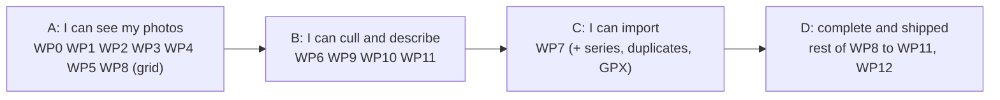

# Milestone M1 plan: a complete culling and organising tool

> **Status: adopted (D-084).** The plan of the first milestone of the product, from the
> first line of product code to a usable pre-release. It follows the milestone table of the
> [specification](functional-specification.md) (§8), the [architecture](architecture.md), the
> [testing strategy](testing-strategy.md) and the [release plan](continuous-integration.md).
> Items are tagged **[decided]**, **[proposed]** or **[open]**. There are no calendar dates: the
> plan gives an order, sizes and exit criteria. The pace depends on review and testing time on
> three platforms, which is Patrick's, so the sizes are relative (S, M, L, XL) and are revised at
> the end of each increment.

## 1. Goal [decided, spec §8]

**M1 gives the photographer a complete culling and organising tool**: catalogues and workspaces,
sources, import from a card or a folder with profiles, previews, culling, series and duplicates,
keywords, ratings, IPTC/XMP, XMP export to source folders, search and filters, and GPS.

There is **no development pipeline yet** (M2). Photos are shown from the **previews embedded in the
files** (RAW and JPEG), which is also what most culling uses. Consequences to state plainly:

- Nothing in M1 needs the wgpu engine: the `pipeline`, `develop` and `export` modules start in
  M2, and their absence in M1 is what keeps M1 achievable.
- An import profile's "apply a style" setting waits for M2 (it needs versions); the profile stores
  it but does not act on it [proposed].
- The focus peaking, clipping warnings, blur score and histogram of the cull mode are computed
  **from the preview**, on the CPU. They say what the preview says, not what the RAW holds. That
  is enough to choose between frames, and is written in the interface's help [proposed].

## 2. Exit criteria [proposed]

M1 is done when **all of these hold on Linux, Windows and macOS**, checked by the automated suite
where possible and by the release checklist (testing strategy §11) otherwise:

1. **The scenarios of §7 pass**, on a catalogue of 100,000 photos and on a small real one.
2. **The budgets** of the specification (§9) that concern M1 are met on Patrick's reference
   machines: grid scrolling, a photo from the preview cache under 100 ms, opening a catalogue
   of 100,000 photos in seconds, search under 200 ms.
3. **The catalogue can be deleted and rebuilt** from the workspace in seconds, with the same result
   (the permanent test of the testing strategy).
4. **A crash at any moment loses no edit** (crash-consistency tests, on all three platforms).
5. **Originals and cards are never modified** (checked by checksum in the import tests, D-018, D-031).
6. **Accessibility and translation**: every control has an accessible name and a keyboard path;
   English and French are complete; the pseudo-locale check passes.
7. **Installable pre-release** `0.1.0` for each platform (unsigned if signing is not ready,
   CI §6.3), with the user-visible documentation of what M1 does.
8. **Interoperability**: sidecars and exported XMP read correctly in ExifTool, and a keyword
   hierarchy and rating written by Auroraw show up in at least one other photo application
   (darktable or digiKam are free) [proposed].

## 3. What is in and out [proposed]

| In M1 | Out (later milestone, or open) |
| --- | --- |
| Catalogues (several, equal), workspaces, rebuild, reconcile | Development, versions, styles, export recipes (M2, M4). Versions exist in the model and the sidecar format (empty), so the format is not changed in M2. |
| Sources: local folders, removable cards, network shares; online/offline/missing; monitoring; add in place | Cameras and phones connected directly, cloud sources (source plugins, M5 or on demand) |
| Import with profiles, verified copy, backup copy, resume, RAW+JPEG pairs, metadata template, GPX | Applying a style at import (M2) |
| Previews and thumbnails from embedded previews; JPEG, TIFF, PNG, DNG and the common RAW formats through the decoder | Full-resolution decoding of RAW pixels (M2); HEIF, AVIF and exotic formats (on demand, as import plugins) |
| Culling: ratings, flags, labels, cull mode, comparison, undo, quality aids | AI aids (M5) |
| Series (automatic), similar-photo suggestions, exact duplicates and their report | |
| Keywords (hierarchy, synonyms), collections, smart collections, IPTC/XMP fields, batch edit | Importing a Lightroom or digiKam vocabulary (stretch, §5 WP10) |
| Search, filters, sorting | |
| GPS: reading, GPX matching with clock offset, offline place names, filter by place | **A map view**, postponed by D-084: it needs map tiles, which means a network request |
| XMP export to source folders (opt-in), external XMP change detection | Automatic XMP mirroring (not in v1, D-066) |
| Plugin API v0, host, and the RAW decoder as a real WebAssembly plugin | The public plugin API (M5); operation plugins (M2) |

## 4. How the work is organised [proposed]

**Increments, not one big bang.** M1 is built as four increments, each a pre-release someone can
use for something. The first increment is a **walking skeleton**: the whole vertical, thin, on
three platforms, so that platform, packaging and performance problems appear in the first weeks
and not in the last.

**A short design note before each work package that fixes a format or an interface**, in
`docs/design/`, followed by a decision entry for anything that changes what the application does,
a file format or an interface (governance §1). Notes are short: the question, the options, the
measurements if any, the proposal.

**Vertical slices.** A package is finished when it works end to end from the interface to the
disk, with its tests, its strings translated in English and French, its accessible names and its
keyboard path (testing strategy §9). No "wire up the interface later".

**Flow of a change** (CI §2): a branch from `dev` per package or slice, the per-change checks on three
platforms, a review. Changes to formats, the write path, the plugin API and the sandbox get the
owner's review; the others may be merged by the author when the checks are green and the change
is small (governance §3).

**Format discipline from the first day.** The first version of each file format is written with its
schema version, its fixture and its "unknown content is preserved" test **in the same change**
(testing strategy §3), because a format released without them is a migration later.

## 5. Work packages [proposed]

Sizes are relative to each other: S about a few focused days, M about a week, L a couple of weeks,
XL more. "Needs" lists the packages that must exist first.

### WP0 Foundation (S to M)

The spikes are archived (tag `spikes-final`, then `spikes/` removed from `dev`, CI §8) and the
repository takes the product layout: root workspace, `crates/` with empty crates and their
licences, `xtask/`, `rust-toolchain.toml`, `deny.toml`, the `ci.yml` of CI §3.1 (lint, build and
test on three platforms, dependencies), the SPDX header check, the test harness (`testkit`:
temporary folders and seeded random generators; the deterministic dataset generator of spike 3
moves with the catalogue schema in WP2, since it is written against it), and the launch test. The spike
harnesses that the testing strategy keeps are **moved, not rewritten**.

Done when: an empty application builds and starts on three platforms from CI, and a trivial
test of each kind runs.

**Status: done** (CI run 35551629942, all jobs green on Linux, Windows and macOS). Differences from
the plan: the dataset generator moves in WP2; `cargo audit` is replaced by `cargo deny`, which reads
the same advisories; a `cargo xtask layers` check enforces the dependency rules of the architecture,
and found that `plugin-api` (MIT OR Apache-2.0) must not depend on `types` (GPL), so it depends on
nothing. Fuzz targets and crash-consistency tests start with the formats in WP1.

### WP1 Formats and workspace (L). Needs WP0

`types` and `format`, then `workspace`.

- **Design notes** for the open questions listed in §6 (layout, file names, state files, sidecar
  content, fingerprint).
- **Photo sidecar**: standard XMP with the stable identifier, the fingerprint and last known
  paths, the cache of the original's capture data (D-074), rating, flags, labels, keywords,
  IPTC fields, and the Auroraw namespace for what XMP has no field for. Unknown content
  preserved.
- **Version sidecar**: the format of D-023 with the history empty for now.
- **State files**: keyword vocabulary, collections, smart collections, series, sources.
- **Atomic writes** (temporary file, then rename), drift detection by size and modification time.
- Fixtures for version 1 of every format; fuzz targets for the readers.

Done when: round trips and unknown-content tests pass; ExifTool reads the photo sidecars; a
workspace of 100,000 photos is written and re-read in the time spike 3 measured, **including on
NTFS** (this replaces the pending Windows run of spike 3, and settles D-075 for the workspace).

**Status: done except one measurement on Patrick's own Windows machine** (CI run of 2026-09-21).
Built: `types` (identifiers, fingerprint and hash, timestamps), `format` (the fingerprint of note 004 with
known-answer tests; the state files of note 002; an XMP reader and canonical writer; the photo and version
sidecars of note 003 with the derived copy and its digest), `workspace` (creation, marker, writer's lock,
atomic writes with the Windows retry, typed reading and writing, the scan, recoverable removal), fixtures,
generated round trips, Lightroom and darktable style files, an ExifTool interoperability test on the three
platforms, fuzz targets run nightly, and the large-workspace measurement (design note 001 §4.2). The fuzzer
found four real bugs in its first runs (namespace addresses with entities, names that cannot be written,
control characters, and floats that did not round trip exactly), all fixed with a regression test and a seed in
the corpus; `cargo deny` found two advisories in the XML library the same day, fixed by upgrading. Reading
225,000 sidecars takes 1.9 s on the developer machine and 10 to 45 s on the slowest CI runners; writing them
takes 500 to 700 s on the Windows CI runner (an SSD). **Done: the same measurement on Patrick's Windows
machine** (issue #1, 2026-09-22), on a real spinning system disk: 1,513 s (25 minutes) to write, 54 s to read
(design note 001 §4.2). Real Windows GPU results also came in the same issue: DirectX 12 on the GTX 1650 SUPER
and the Intel UHD 630 both pass the smoke test of spike 1, closing that risk (architecture §14, item 2).
WP1 is now fully done. **What the HDD number changes: batch writing needs a background job with progress on
any disk, and on a spinning one a first import or a rebuild is tens of minutes, not seconds; the interface must
not promise "a few seconds" unconditionally** (design note 001 §4.2, and risk item 2 below).

### WP2 Catalogue (L). Needs WP1

`catalogue`: the schema of spike 3 promoted to product (photos, versions, keywords with paths,
series, collections, sources, cameras, lenses, full-text index, the stored effective rating),
`user_version` migrations, the query API with **keyset paging** and counts, batch changes in one
transaction, **rebuild and reconcile** (architecture §5.3, §5.4), the registry of several
catalogues.

Done when: the queries of spike 3 give the same times through the product API; the permanent
rebuild test and the crash-consistency tests pass on three platforms; the query results agree
with a slow reference implementation on generated data.

**Status: done, pending the nightly run on Windows and macOS.** Built: `catalogue` with the schema
of spike 3 (text identifiers as primary keys instead of spike 3's integers, since the catalogue is
an index over the workspace's own identifiers, note 001 §5.2), `user_version` migrations (one
version so far, a `NewerSchema` refusal for a future one), keyset queries (`list_recent`,
`list_by_min_rating`, `list_by_camera`, `list_by_keyword`, `search` over FTS5, counts), atomic
rebuild to a temporary file with a Windows-safe rename (note 001 §5.4), reconcile against stored
sidecar stats, and the local registry of catalogues (note 001 §5.7). The dataset generator of
spike 3 moved here, reproducible from a seed (including every identifier, needed to replay a
failing test). `cargo xtask layers` was relaxed to leave dev-dependencies unrestricted, so this
crate's tests can build a real `Workspace` (a normal dependency would have broken the crate
layering of architecture §3.2) and exercise the whole write-scan-rebuild path end to end.

That end-to-end test caught a real bug on its first run: a vocabulary read back from its state
file is sorted by identifier (note 002), not parent-before-child, and the naive insert order
violated the `keyword.parent_id` foreign key. Fixed by deferring foreign-key checks to the
transaction's commit (`PRAGMA defer_foreign_keys`) rather than topologically sorting every entity
type — the general fix, since any table's insertion order can end up this way. A regression test
holds the case (the in-memory tests that fed data straight from the generator never had, since the
generator itself produces parent-before-child order).

A 100,000-photo run, on the developer machine and (the same night) on all three CI runners:

| | Developer (Linux, NVMe) | CI Linux | CI Windows | CI macOS |
| --- | --- | --- | --- | --- |
| Generate | 13.4 s | 8.7 s | 6.5 s | 11.4 s |
| Rebuild | 17.3 s | 11.1 s | 20.6 s | 14.6 s |
| A page of 200, most recent | 0.3 ms | 0.3 ms | 0.2 ms | 0.2 ms |
| "Rating 4 or more", a page | 42 ms | 41 ms | 49 ms | 52 ms |
| Full-text search | 24 ms | 23 ms | 27 ms | 24 ms |
| One photo by identifier | 0.02 ms | 0.02 ms | 0.01 ms | 0.01 ms |

Every query is comfortably inside the 200 ms budget (spec §9), consistently across platforms.
The two slower ones (rating and search) are still higher than spike 3's own figures for similarly
named queries. `EXPLAIN QUERY PLAN` shows why: both use the right index to filter, then sort the
results in a temporary b-tree, which costs more here because this dataset's uniform 0–5 ratings
and repeated placeholder title make both conditions match a much larger, less realistic share of
the photos than spike 3's dataset did. Not a defect, and not chased further in WP2; a more
realistic generator is a cheap improvement for whichever milestone next needs tighter numbers.
The measurement now runs nightly on all three platforms alongside the workspace one.

### WP3 Engine, job system and CLI (M). Needs WP1; grows with WP2

`engine`: commands and events, the single writer, the worker pool sized to physical cores,
priorities and cancellation (the thumbnail queue serves the latest request first), event
batching, deadlines and progress. `cli`: create a catalogue, add a folder, list, rebuild, verify.

Done when: the engine scenarios of the testing strategy §3 can be scripted through the CLI with
no window, and a stress test with commands from several threads ends in the state a sequential
replay gives.

### WP4 Sources (L). Needs WP2, WP3

The `Source` interface in `plugin-api` (list, stat, read by range, watch, writable or not);
**local folders** and **removable volumes** implementing it; states online/offline/missing;
monitoring with `notify` for local folders and periodic rescan for shares; **adding in place**;
new files reported and added on confirmation (D-019); the fingerprint (§6 item 5); reconcile of
a source against the catalogue (moved, renamed and deleted files).

Done when: a folder is added, edited outside the application, unplugged and replugged, and the
catalogue follows without loss; a card is recognised as a volume on all three platforms.

### WP5 Imaging: previews and thumbnails (L). Needs WP2

`imaging`: metadata and **embedded preview** extraction for the common RAW formats, JPEG, TIFF,
PNG, DNG (`rawler` behind a `Decoder` interface, native for now), thumbnail generation with
the measured spike 3 method (no copies, decode at reduced size), the **previews database**
(D-075), the colour conversion of previews to sRGB (§9 item 1), and the perceptual hash for
similarity (WP9). Applies the sidecar's stored preview dimensions and orientation.

Done when: a 1,000-photo import produces thumbnails at spike 3's rate on each platform; the decoder
passes the sample-file checks of the testing strategy §3; a corrupt file fails cleanly.

### WP6 Plugin API v0 and host (L). Needs WP4, WP5

`plugin-api` (declaration schema, the `Source` and `Decoder` interfaces, permissions) and
`plugin-host` (the wasmtime host of spike 4 made a product component: limits, epoch interruption,
compiled cache, grants). **The decision left open by the spikes is made here**: the C-style
interface against the WebAssembly component model, after a small measurement (§6 item 1). The
`rawler` decoder becomes **the first real WebAssembly plugin**, loaded through the host, and the
tests prove it returns exactly what the native one does (the spike's identical-pixels check).
The hostile-plugin tests of spike 4 become permanent.

Done when: importing 1,000 photos through the WebAssembly decoder is within the spike's 2 times of
native on one thread, and several files decode in parallel; all hostile cases leave the host alive on
three platforms; the API is marked experimental.

### WP7 Import (XL). Needs WP4, WP5; uses WP6

Import profiles (D-029: destination and renaming templates, backup copies, metadata template,
RAW+JPEG rule, the style slot); **verified copy** by checksum, backup copy, resume, skip of known
files by fingerprint with a report, unique suffix on collision, RAW+JPEG pairing; the metadata
template written to the sidecars, never to the files; **culling while the copy runs**; the final
"All N files copied and verified" and the offer to eject; **card detection** on each platform and
the one-click "Import with profile X"; GPX matching with clock offset and time zone.

Done when: an interrupted import resumes; a card checksum is identical before and after; a
second import of the same card copies nothing; the import of a 2,000-photo card into the
interface does not stall the interface thread; cards with several cameras and clashing numbers
behave as designed (§6 item 6).

### WP8 Interface shell and library (XL). Needs WP2, WP3; grows all along

The Slint application: shell organised by task, the **library grid** built on spike 3's virtualised
model over the engine's queries, the panels (filters, collections, keywords, metadata), the
**command system** (every action is a command reachable by keyboard, menu and later a palette),
**undo** across the application, the settings, the **translation** setup with English and French and
the pseudo-locale, the accessibility baseline, the layout that survives a 4K screen and a small
laptop. Colour of previews as §9 item 1.

Done when: the grid holds 60 frames per second on a 100,000-photo catalogue on each platform
with the engine under load, and the AT-SPI, translation and keyboard checks of the testing
strategy §6 pass on the shell.

### WP9 Culling (XL). Needs WP5, WP8

Single-image view (zoom and pan on the preview, the 100 % view of the preview), **cull mode**
(full screen, filmstrip, one key per rating, flag and label, auto-advance option), **comparison of
2 to 4 images** with linked zoom and pan, ratings, flags (Picked, Rejected) and labels with
several-step undo, the Rejected view, "Show in file manager" and the exportable rejected list,
**quality aids** (peaking, clipping warnings, blur score, histogram) on the preview, **series**
(automatic from metadata with an adjustable gap, expand in place, edit by hand, resolve with a
gesture that flags the others Rejected), **similar-photo suggestions**, **exact duplicates**
(one photo, several locations) and the duplicates report.

Done when: culling 1,000 photos with the keyboard alone is possible and fast; resolving a series
and undoing it restores every rating; the series and their resolution survive a rebuild.

### WP10 Metadata, keywords and GPS (L). Needs WP1, WP8

The IPTC and XMP fields (§6 item 8), editing one photo and batches with undo, copy and paste
of metadata, **keyword vocabulary** (hierarchy, synonyms, "do not export" flag) with the flat and
hierarchical forms written and read, collections and **smart collections**, external XMP change
detection and its confirmation (D-047, §6 item 9), **XMP export to source folders** (D-024,
opt-in), offline **place names** and the place filter. *Stretch*: importing a vocabulary from
another application.

Done when: a keyword hierarchy and a rating round trip through ExifTool and one other
application; an external change to a sidecar is detected, shown and applied on confirmation
without a feedback loop; a batch edit of 10,000 photos is one transaction, undoable.

### WP11 Search and filters (M). Needs WP2, WP8, WP10

Full-text search, filter panel with facets (rating, flags, labels, keywords, camera, lens, date,
place, series state, source), sorting, **saved searches and smart collections**.

Done when: the queries of spike 3 stay under budget through the interface, and a filter change
shows a full page of thumbnails in the time spike 3 measured.

### WP12 Packaging, documentation and release (L). Needs the rest; started early

`release.yml` (CI §3.3), the Flatpak, AppImage, Windows installer and zip, macOS `.dmg`, signing
as ready (CI §6.3), the launch test on the built artifacts, the release checklist of the testing
strategy §11, the user documentation for M1 features, and the changelog. Packaging is exercised
**at every increment**, not only at the end.

Done when: `0.1.0` installs, runs, upgrades from the previous pre-release and uninstalls on the three platforms.

## 6. Questions to settle at the start [proposed answers]

The open questions of the specification that M1 must answer, with the answer proposed for each
and how it is checked. Each one becomes a short design note and, if it changes a format or the
behaviour, a decision entry after Patrick's approval.

| # | Question (spec §10) | Proposed answer | How it is checked |
| --- | --- | --- | --- |
| 1 | **Host-to-plugin interface** (Q11) | Decide between the hand-made C interface of spike 4 and the WebAssembly component model, on a **small measurement** of the component model's call cost, tile copy cost and tooling for Rust, before the interface is used by anything but the decoder. The interface stays behind `plugin-api`, experimental until M5. | Micro-benchmark in WP6, compared with spike 4's 40 ns and 12 ms. |
| 2 | **Workspace layout** (Q2) | Files sharded by the first two characters of the photo identifier (256 folders of about 400 files at 100,000 photos), named `<original name>~<short id>.xmp`, so a person can find a photo's sidecar and no folder holds a huge list. Default workspace location under the user's Pictures folder, chosen at creation. | Listing and rebuild times on NTFS, ext4 and APFS at 100,000 files (WP1). |
| 3 | **State file formats** (Q3) | One JSON file per kind (vocabulary, collections, smart collections, series, sources), each with its schema version, written atomically; collections and series large enough to be split are written in parts by identifier range. | Round-trip and unknown-content tests; the rebuild test. |
| 4 | **Version sidecar** (Q4) | As in spike 3: XMP with the Auroraw namespace and the history as JSON inside one property. Emptied history in M1, filled in M2. | ExifTool and other readers still read the XMP; a fixture per version. |
| 5 | **Content fingerprint** (Q6) | The **whole file's BLAKE3 hash** when the file is copied by import (the checksum is computed anyway for verification); for files added in place, a **sampled fingerprint** (size plus 64 KB from the head, middle and tail) first, and the full hash computed lazily in the background. The stable identifier in the sidecar, with the last known path and the capture data, is what relinks a file edited elsewhere. | Speed on a network share; a false-match test on generated near-identical files. |
| 6 | **Import details** (Q14, Q16) | Default destination `<archive>/<year>/<year-month-day>`; renaming tokens for date and time, sequence, camera, original name, shoot name; several cameras sort by capture time; a clashing number gets a unique suffix; card detection from the mounted volumes with a DCIM folder; when two copies carry different metadata, the one with the newer modification time wins and the other is shown in the import report, with no silent loss. | WP7 tests with generated cards; a review of the report wording. |
| 7 | **Series and similarity** (Q15) | Time-gap rule with a default of 2 seconds and bracketing recognised from the exposure metadata; a 64-bit perceptual hash of the preview for suggestions; a series' cover is its first frame unless chosen; a multi-location photo prefers the online source, then the fastest. Key bindings modelled on the common ones (number keys for rating, one key each for Picked and Rejected) and configurable. | WP9 tests on burst samples; the hash's cost at 100,000 photos measured. |
| 8 | **IPTC and XMP field list** (Q26) | The IPTC Core fields, the useful IPTC Extension subset, plus rights and location fields, listed in a design note, without custom fields in M1. | Interop check with ExifTool. |
| 9 | **XMP monitoring without loops** (Q28) | Auroraw records the size and modification time of each sidecar and source XMP after it writes; a change matching them is its own and is ignored. | A test that writes, watches and asserts no reaction. |
| 10 | **Workspace unavailable** (Q7) | **Read-only mode** from the local catalogue, with a clear banner; edits are not queued. | A scenario with a share that goes away. |
| 11 | **Source change reporting** (Q35, in part) | Local folders watched by events, shares rescanned by size and time; sign-in for network sources handled by the operating system's mount, not by Auroraw, in M1. | WP4 tests. |
| 12 | **Geocoding database** (Q29) | An offline, redistributable place database (GeoNames-derived, CC BY) shipped as a downloadable pack, showing its attribution; a few levels (country, region, city). | Size and lookup time; licence check. |

## 7. Acceptance scenarios [proposed]

Written as tests where they can be, and run by Patrick where they cannot. Each is done on a
catalogue of 100,000 generated photos **and** on a small real one.

1. **From the card to a culled shoot.** Insert a card of 500 files (RAW and JPEG pairs, two
   cameras), click "Import with profile", start culling after the first photos appear, kill the
   application in the middle, restart, finish the copy, and end with a verified card and
   every photo culled with the keyboard.
2. **Rebuild.** Delete the catalogue, rebuild from the workspace, and see the same photos,
   ratings, keywords, series and collections.
3. **The disappearing disk.** Unplug a source, keep browsing, replug it, see it online again with nothing lost.
4. **The two locations.** Add the same folder from the working disk and its backup: one photo
   with two locations, one sidecar, a duplicates report.
5. **Keywords for 3,000 photos.** Build a hierarchy, apply it in batches, undo, search on it,
   and see the same result in another application.
6. **An external edit.** Change a sidecar with another program while Auroraw runs: it is signalled,
   and applied on confirmation.
7. **The first launch** on a clean machine, in French, with a screen reader on.

## 8. Order and increments [proposed]

| Increment | Delivers | Exit |
| --- | --- | --- |
| **A. I can see my photos** (`0.1.0-alpha.1`) | The foundation, formats, catalogue, engine, a folder added in place, thumbnails from previews, the grid, rebuild. On three platforms, packaged. | Scenarios 2 and 3 in their first form; the budgets for the grid; the format fixtures v1 exist. |
| **B. I can cull and describe** (`alpha.2`) | The plugin host with the decoder as a WebAssembly plugin, culling and cull mode, comparison, ratings, flags, labels, keywords, collections, IPTC/XMP editing, search and filters. | Scenarios 4 and 5; the decoder within its budget. |
| **C. I can import** (`alpha.3`) | Import with profiles, verified copy, card detection, RAW+JPEG, series, similar suggestions, duplicates report, GPX. | Scenario 1. |
| **D. Complete** (`0.1.0`) | XMP export and external change detection, place names, the quality aids, the polish, the documentation, translations complete, the release checklist, signing as available. | Every exit criterion of §2. |

An increment's pre-release goes to Patrick to test on his machines; the results guide the next.
The sizes above are re-estimated at the end of A, when the actual pace is known.

## 9. Risks and open points

| # | Item | Risk | Mitigation or decision |
| --- | --- | --- | --- |
| 1 | **Colour of previews** | Embedded previews are sRGB, Adobe RGB or something else, and a wide-gamut screen shows wrong colours without the display profile (a task per platform, architecture §6.5). | Decided (D-084): M1 converts previews to sRGB and displays them as sRGB; the display profile and full colour management come with the pipeline in M2. |
| 2 | **A spinning disk is slow, not just NTFS** | Measured (design note 001 §4.2, issue #1): 25 minutes to write a 100,000-photo workspace on a real HDD, against 4 s on the developer's NVMe. D-075 (the thumbnail database) is still provisional. | Batch writes and rebuilds run as a background job with progress on every platform (already planned, note 003 §5.3); consider detecting a slow disk and adjusting the wording of "a few seconds" in the interface (WP1 or WP8); the thumbnail database still needs its own NTFS measurement. |
| 3 | **A map view** | It needs map tiles, hence a network request (D-061 says not without consent). | Decided (D-084): the map is left to a later milestone; GPS reading, GPX and place names stay in M1. |
| 4 | **Slint on macOS** | OpenGL is deprecated; a keyword tree and a big grid are heavier than spike 2's tests. | The first increment runs on macOS; Skia or Metal renderer evaluated in WP8 if needed. |
| 5 | **Card detection per platform** | Three sets of system calls; a Mac and a card reader are not always to hand. | Detect mounted volumes with a DCIM folder in a small platform module; test with a disk image; the manual folder import always works. |
| 6 | **Decoder coverage and speed** | `rawler` does not know every camera; WebAssembly decoding is 1.3 to 2 times slower. | Camera-support issues with samples (governance §3); decode several files in parallel; LibRaw as a later plugin. |
| 7 | **Interface thread stalls** | A responsive grid under a busy import is the hardest UI goal. | The instrumented stall check in the interface tests (testing strategy §6); all work on workers. |
| 8 | **Metadata interoperability** | The XMP standards are loose and other applications write them differently. | ExifTool in CI reads what we write; a fixtures folder of files from other applications. |
| 9 | **Scope creep** | Similarity, a vocabulary import, a map and a command palette can each take a package. | They are marked stretch; an increment ships without them. |
| 10 | **Review load** | Every change to formats and the sandbox waits for the owner. | Small changes; design notes agreed before code; the checklist in the pull request template. |
| 11 | **Signing not ready** | Windows and macOS warnings on first pre-releases. | Unsigned alphas with a clear note (D-081). |
| 12 | **AI-written code volume** | A large amount of code arrives quickly; quality and licence review matter. | The checks of the testing strategy, the DCO, small pull requests, the owner's review on the sensitive areas. |

## 10. What is needed from Patrick [proposed]

- **Approval** of this plan, and of the proposed answers of §6 as each design note comes up.
- **Test time** on Windows and macOS at the end of each increment (the release checklist, testing
  strategy §11), and his own photos for **dogfooding**: a real catalogue is the best test. His
  photos are never put in the repository or in a test (testing strategy §1).
- **Reference machines**: the Linux desktop and the Windows dual boot, and a Mac when one can be had.
- **The decisions marked open** in §9, when their package approaches.
- **The SignPath application** (D-081) before the first signed release.

## 11. Next

1. Review this plan.
2. **WP0**: archive the spikes, lay out the repository, first CI, first test harness.
3. **WP1** design notes (§6, items 2 to 5), one at a time, for approval.
